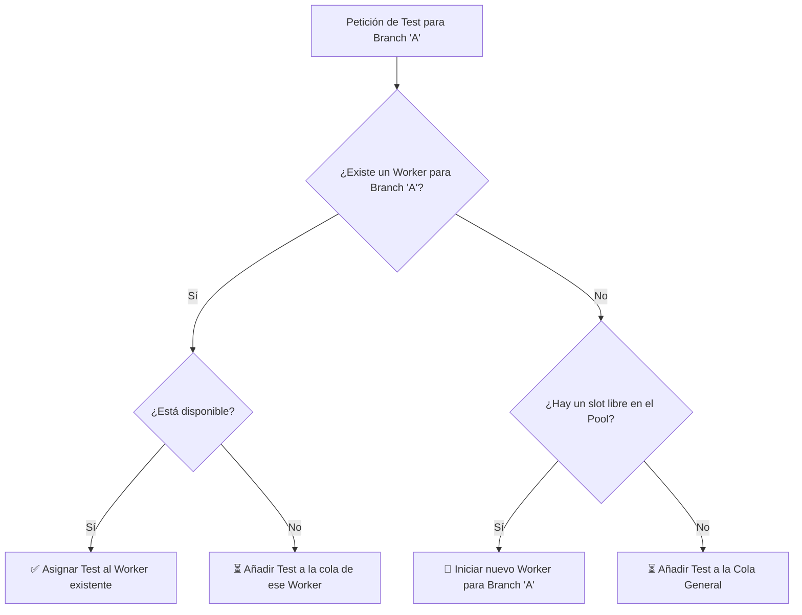

# Plan de Arquitectura: Workers Persistentes

## 1. Objetivo

Evolucionar el sistema de un modelo de "jobs efímeros" (donde todo se crea y destruye por cada test) a un modelo de **"workers persistentes"**. El objetivo es mejorar drásticamente la eficiencia y velocidad para la ejecución de tests consecutivos sobre una misma branch, eliminando la necesidad de clonar e instalar dependencias repetidamente.

---

## 2. Conceptos Clave

La nueva arquitectura se basa en dos componentes principales que conviven en el servidor Node.js.

### a. El Orquestador (`server.js`)

Es el cerebro del sistema. Es el proceso principal y de larga duración. Sus responsabilidades son:

- **Gestionar la UI:** Atender las peticiones de la interfaz web (listar branches, features, etc.).
- **Gestionar el Pool de Workers:** Mantener y supervisar un conjunto de procesos hijos ("workers").
- **Gestionar la Cola General:** Encolar los tests solicitados cuando todos los workers estén ocupados.
- **Despachar Tareas:** Asignar tests a los workers apropiados según la branch solicitada.
- **Centralizar Logs:** Recibir los logs de todos los workers y retransmitirlos al cliente web correcto.

### b. El Worker (`worker.js`)

Es el "trabajador". Es un **proceso hijo de Node.js de larga duración** lanzado por el Orquestador. Cada worker vive en uno de los "slots" de paralelismo definidos por `MAX_PARALLEL_TESTS`.

La vida de un worker se divide en dos fases principales:

1.  **Fase de Inicialización (Lenta, se hace una sola vez por branch):
    *   Se le asigna una `branch`.
    *   Clona el repositorio de esa `branch` en un directorio propio y persistente.
    *   Ejecuta `yarn install` para instalar las dependencias.
    *   Una vez completado, el worker se marca como `disponible` y queda a la espera de tests para su branch asignada.

2.  **Fase de Ejecución de Test (Rápida, se hace por cada feature):
    *   Recibe la orden de ejecutar un `feature` específico.
    *   Busca un emulador libre en Redis y lo reserva.
    *   Inicia un servidor Appium para ese emulador.
    *   Ejecuta el test con `wdio`.
    *   Al finalizar, detiene Appium y libera el emulador en Redis.
    *   Queda `disponible` para el siguiente test de la misma branch.

---

## 3. Flujo de Decisión del Orquestador

Cuando un usuario solicita un test para una `branch-A`, el Orquestador sigue esta lógica:

---

## 4. Comunicación Orquestador <-> Worker

La comunicación entre `server.js` y cada `worker.js` será más sofisticada:

- **IPC (Inter-Process Communication):** Se usará el canal de comunicación nativo de Node.js para procesos hijos. El Orquestador enviará comandos (`{ command: 'RUN_TEST', ... }`) y el Worker devolverá mensajes de estado (`{ status: 'READY' }`, `{ status: 'DONE' }`).
- **Streams (stdout/stderr):** El Worker seguirá enviando todos sus logs (salida de `git`, `yarn`, `wdio`, etc.) a través de sus streams `stdout` y `stderr`. El Orquestador los recogerá y los retransmitirá por WebSocket a la UI.

---

## 5. Ventajas y Desventajas

- **Ventaja Principal:** Rendimiento muy superior. El ahorro de tiempo al no tener que clonar/instalar para cada test es enorme, especialmente para ráfagas de tests en la misma branch.
- **Desventaja Principal:** La complejidad del código del Orquestador (`server.js`) aumenta significativamente. Pasa de ser un simple despachador a un gestor de estado de un pool de procesos, lo cual requiere una lógica más cuidadosa y robusta.

---

## 6. Plan de Acción (Implementación Incremental)

### Estado Actual (25/08/2025)

La implementación actual es un **modelo de "jobs efímeros"**. 
- `server.js` lanza un nuevo proceso `worker.js` por cada test.
- `worker.js` ejecuta un único script y luego termina usando `process.exit()`.
- Esto **no** cumple el objetivo de persistencia, ya que el clonado y la instalación de dependencias se repiten en cada ejecución.

### Próximo Paso: Convertir el Worker a Persistente

El objetivo inmediato es modificar el worker para que se mantenga vivo después de un test, listo para recibir nuevas tareas.

#### Tareas Inmediatas:

1.  **Modificar `worker.js`:**
    *   En el manejador del evento `close` del script `feature-runner.sh`, **eliminar la llamada a `process.exit()`**. Esto es el cambio crucial que evitará que el worker muera.
    *   Una vez que el script termina, el worker debe enviar un nuevo mensaje al orquestador, por ejemplo: `{ type: 'READY_FOR_NEXT_JOB' }`. Esto le indicará al `server.js` que el worker está libre.

2.  **Refactorizar `server.js`:**
    *   La estructura `executionSlots` actual es insuficiente. Se debe reemplazar por una estructura más rica que almacene el estado de cada worker, por ejemplo: `workerPool = [{ process, branch, status: 'initializing' | 'ready' | 'busy' }]`.
    *   Modificar la lógica de `processQueue` y `executeJob`:
        *   Al recibir una petición de test, el orquestador debe buscar en `workerPool` si ya existe un worker para la `branch` solicitada con `status: 'ready'`.
        *   **Si existe:** Le envía el nuevo trabajo con `worker.process.send({ type: 'START', ... })`.
        *   **Si no existe y hay un slot libre:** Lanza un nuevo worker, lo asocia a la `branch` y lo guarda en el `workerPool`.
        *   **Si no hay slots libres:** El trabajo permanece en la cola general (`jobQueue`).
    *   Manejar el nuevo mensaje `{ type: 'READY_FOR_NEXT_JOB' }` del worker para actualizar su estado a `'ready'` en el `workerPool`.

---

## 7. Arquitectura de Scripts del Worker (Refinamiento)

### Problema Detectado

Durante las pruebas, se observó que, aunque el proceso `worker.js` era persistente, el script que ejecutaba (`feature-runner.sh`) seguía clonando el repositorio e instalando dependencias en cada ejecución. Esto anulaba el beneficio de tener un worker persistente.

### Solución: Separación de Responsabilidades

Para solucionar esto, la lógica de los scripts se divide en dos fases claras, orquestadas por `worker.js`:

#### a. Fase de Setup (Script: `setup-workspace.sh`)

*   **Objetivo:** Preparar un entorno de trabajo limpio y reutilizable.
*   **Ejecución:** Se ejecuta **una sola vez** al inicio de la vida de un worker.
*   **Acciones:**
    1.  Recibe una ruta a un directorio de trabajo único y persistente (ej: `/tmp/worker-123`).
    2.  Clona el repositorio de la `branch` asignada en ese directorio.
    3.  Instala las dependencias (`yarn install`).
*   **Orquestación:** `worker.js` es responsable de crear el directorio y llamar a este script. No notificará que está `READY` al `server.js` hasta que este script finalice con éxito.

#### b. Fase de Ejecución (Script: `feature-runner.sh` modificado)

*   **Objetivo:** Ejecutar un test específico de forma rápida en un entorno ya preparado.
*   **Ejecución:** Se ejecuta **por cada feature** que se le asigna al worker.
*   **Acciones:**
    1.  Recibe la ruta al directorio de trabajo ya existente.
    2.  Se posiciona en ese directorio.
    3.  Ejecuta `git pull` para sincronizar los últimos cambios de la `branch`.
    4.  Procede con la lógica de ejecución de test que ya tenía (descargar APK, buscar emulador, correr `wdio`, limpiar).
    5.  **Ya no** clona, ni crea directorios temporales, ni instala dependencias.

Este nuevo modelo asegura que el trabajo costoso de preparación se realiza una única vez, y las ejecuciones posteriores son mucho más rápidas, cumpliendo así el objetivo original de la arquitectura de workers persistentes.
