# Plan de Arquitectura: Workers Persistentes

## 1. Objetivo

Evolucionar el sistema de un modelo de "jobs efímeros" (donde todo se crea y destruye por cada test) a un modelo de **"workers persistentes"**. El objetivo es mejorar drásticamente la eficiencia y velocidad para la ejecución de tests consecutivos sobre una misma branch, eliminando la necesidad de clonar e instalar dependencias repetidamente.

---

## 2. Conceptos Clave

La nueva arquitectura se basa en dos componentes principales que conviven en el servidor Node.js.

### a. El Orquestador (`server.js`)

Es el cerebro del sistema. Es el proceso principal y de larga duración. Sus responsabilidades son:

- **Gestionar la UI:** Atender las peticiones de la interfaz web (listar branches, features, etc.).
- **Gestionar el Pool de Workers:** Mantener y supervisar un conjunto de procesos hijos ("workers").
- **Gestionar la Cola General:** Encolar los tests solicitados cuando todos los workers estén ocupados.
- **Despachar Tareas:** Asignar tests a los workers apropiados según la branch solicitada.
- **Centralizar Logs:** Recibir los logs de todos los workers y retransmitirlos al cliente web correcto.

### b. El Worker (`worker.js`)

Es el "trabajador". Es un **proceso hijo de Node.js de larga duración** lanzado por el Orquestador. Cada worker vive en uno de los "slots" de paralelismo definidos por `MAX_PARALLEL_TESTS`.

La vida de un worker se divide en dos fases principales:

1.  **Fase de Inicialización (Lenta, se hace una sola vez por branch):
    *   Se le asigna una `branch`.
    *   Clona el repositorio de esa `branch` en un directorio propio y persistente.
    *   Ejecuta `yarn install` para instalar las dependencias.
    *   Una vez completado, el worker se marca como `disponible` y queda a la espera de tests para su branch asignada.

2.  **Fase de Ejecución de Test (Rápida, se hace por cada feature):
    *   Recibe la orden de ejecutar un `feature` específico.
    *   Busca un emulador libre en Redis y lo reserva.
    *   Inicia un servidor Appium para ese emulador.
    *   Ejecuta el test con `wdio`.
    *   Al finalizar, detiene Appium y libera el emulador en Redis.
    *   Queda `disponible` para el siguiente test de la misma branch.

---

## 3. Flujo de Decisión del Orquestador

Cuando un usuario solicita un test para una `branch-A`, el Orquestador sigue esta lógica:

```mermaid
graph TD
    A[Petición de Test para Branch 'A'] --> B{¿Existe un Worker para Branch 'A'?};
    B -- Sí --> C{¿Está disponible?};
    C -- Sí --> D[✅ Asignar Test al Worker existente];
    C -- No --> E[⏳ Añadir Test a la cola de ese Worker];
    B -- No --> F{¿Hay un slot libre en el Pool?};
    F -- Sí --> G[🚀 Iniciar nuevo Worker para Branch 'A'];
    F -- No --> H[⏳ Añadir Test a la Cola General];
```

---

## 4. Comunicación Orquestador <-> Worker

La comunicación entre `server.js` y cada `worker.js` será más sofisticada:

- **IPC (Inter-Process Communication):** Se usará el canal de comunicación nativo de Node.js para procesos hijos. El Orquestador enviará comandos (`{ command: 'RUN_TEST', ... }`) y el Worker devolverá mensajes de estado (`{ status: 'READY' }`, `{ status: 'DONE' }`).
- **Streams (stdout/stderr):** El Worker seguirá enviando todos sus logs (salida de `git`, `yarn`, `wdio`, etc.) a través de sus streams `stdout` y `stderr`. El Orquestador los recogerá y los retransmitirá por WebSocket a la UI.

---

## 5. Ventajas y Desventajas

- **Ventaja Principal:** Rendimiento muy superior. El ahorro de tiempo al no tener que clonar/instalar para cada test es enorme, especialmente para ráfagas de tests en la misma branch.
- **Desventaja Principal:** La complejidad del código del Orquestador (`server.js`) aumenta significativamente. Pasa de ser un simple despachador a un gestor de estado de un pool de procesos, lo cual requiere una lógica más cuidadosa y robusta.
