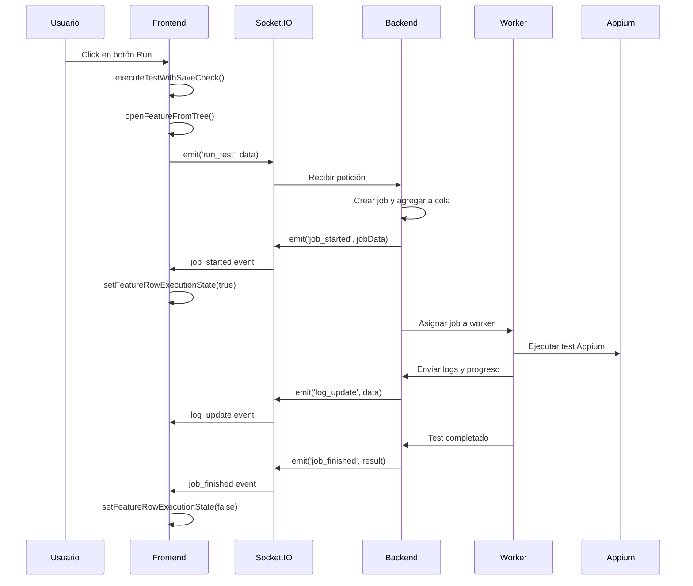

# Arquitectura General - Appium Orchestrator Web

## 📋 Visión General

**Appium Orchestrator Web** es una aplicación web completa diseñada para orquestar, monitorear y gestionar la ejecución de tests Appium en un entorno distribuido. La aplicación proporciona una interfaz unificada para la gestión de workspaces, ejecución de tests, monitoreo en tiempo real e integración con sistemas de control de versiones.

## 🏗️ Arquitectura de Alto Nivel

```
┌─────────────────────────────────────────────────────────────┐
│                    Frontend (Browser)                        │
├─────────────────────────────────────────────────────────────┤
│  ┌─────────────────┐  ┌─────────────────┐  ┌─────────────────┐ │
│  │   UI Module     │  │   Main Module   │  │  Socket Module  │ │
│  │   (ui.js)       │  │   (main.js)     │  │   (socket.js)   │ │
│  └─────────────────┘  └─────────────────┘  └─────────────────┘ │
│  ┌─────────────────┐  ┌─────────────────┐  ┌─────────────────┐ │
│  │   API Module    │  │ Progress Ind.   │  │  WireMock Mod.  │ │
│  │   (api.js)      │  │  (progress.js)  │  │  (wiremock.js)  │ │
│  └─────────────────┘  └─────────────────┘  └─────────────────┘ │
└─────────────────────────────────────────────────────────────┘
                              │
                         ┌─────────────────┐
                         │  Socket.IO      │
                         │  Communication │
                         └─────────────────┘
                              │
┌─────────────────────────────────────────────────────────────┐
│                     Backend (Node.js)                        │
├─────────────────────────────────────────────────────────────┤
│  ┌─────────────────┐  ┌─────────────────┐  ┌─────────────────┐ │
│  │   Express       │  │   Socket.IO     │  │   Authentication│ │
│  │   Server        │  │   Server        │  │   (Passport)    │ │
│  └─────────────────┘  └─────────────────┘  └─────────────────┘ │
│  ┌─────────────────┐  ┌─────────────────┐  ┌─────────────────┐ │
│  │   Git           │  │   File System   │  │   Worker Pool   │ │
│  │   Integration   │  │   Management    │  │   Management    │ │
│  └─────────────────┘  └─────────────────┘  └─────────────────┘ │
└─────────────────────────────────────────────────────────────┘
                              │
                    ┌─────────────────┐
                    │   External      │
                    │   Services     │
                    └─────────────────┘
```

## 🔄 Flujo de Datos Principal

### 1. Inicialización de la Aplicación

```javascript
// main.js - Punto de entrada principal
document.addEventListener('DOMContentLoaded', () => {
  checkAuthStatus(); // 1. Verificar autenticación
});

async function checkAuthStatus() {
  const user = await getCurrentUser(); // api.js
  if (user) {
    initializeApp(); // 2. Inicializar aplicación
  }
}

async function initializeApp() {
  const socket = io(); // 3. Establecer conexión Socket.IO
  initializeSocketListeners(socket); // 4. Configurar listeners
  initializeAppControls(socket); // 5. Configurar controles
  initIdeView({ /* 6. Inicializar IDE */ }); 
}
```

### 2. Flujo de Ejecución de Tests



## 📁 Estructura del Proyecto

```
appium-orchestrator-web/
├── docs/                           # Documentación
├── public/                         # Frontend
│   ├── index.html                  # Página principal
│   ├── css/                        # Estilos
│   │   ├── styles.css             # Estilos generales
│   │   └── ide.css                # Estilos del IDE
│   ├── js/                         # Módulos JavaScript
│   │   ├── api.js                 # API del backend
│   │   ├── main.js                # Lógica principal
│   │   ├── ui.js                  # Componentes UI
│   │   ├── socket.js              # Eventos Socket.IO
│   │   ├── progress-indicator-manager.js # Indicadores de progreso
│   │   └── wiremock.js            # Gestión WireMock
│   └── reports/                   # Reportes generados
├── scripts/                        # Scripts de sistema
│   ├── feature-runner.sh          # Ejecutor de features
│   ├── setup-workspace.sh         # Configuración de workspace
│   ├── start-appium.sh            # Inicio de Appium
│   └── ...                        # Otros scripts
├── wiremock/                       # Configuraciones WireMock
│   └── mappings/                  # Mappings HTTP
├── server.js                       # Servidor backend
├── worker.js                       # Sistema de workers
├── package.json                    # Dependencias
└── docker-compose.yml              # Configuración Docker
```

## 🔧 Componentes Principales

### Backend (Node.js + Express)

#### **server.js** - Servidor Principal
- **Autenticación**: Google OAuth 2.0 con Passport.js
- **API REST**: Endpoints para gestión de workspaces, features, etc.
- **Socket.IO**: Comunicación en tiempo real con frontend
- **Gestión de Sesiones**: Express Session middleware

#### **worker.js** - Sistema de Workers
- **Pool de Workers**: Gestión de ejecución paralela
- **Cola de Jobs**: Sistema de cola con prioridades
- **Integración Appium**: Comunicación con dispositivos Appium
- **Manejo de Logs**: Captura y envío de logs en tiempo real

### Frontend (Vanilla JavaScript)

#### **Módulo API** (`api.js`)
```javascript
// Funciones principales de API
export async function fetchFeatures() { /* ... */ }
export async function getFeatureContent(branch, client, feature) { /* ... */ }
export async function saveFeatureContent(branch, client, feature, content) { /* ... */ }
export async function getWorkspaceStatus(branch) { /* ... */ }
export async function getCurrentUser() { /* ... */ }
```

#### **Módulo UI** (`ui.js`)
```javascript
// Componentes principales de UI
export function initIdeView({ onSave, onCommit, onRun }) { /* ... */ }
export function setIdeEditorContent({ content, isReadOnly, isModified }) { /* ... */ }
export function renderFeatureTree(parentElement, nodes, config) { /* ... */ }
export function addFeatureControls(li, featureName) { /* ... */ }
export function switchTab(tabName) { /* ... */ }
```

#### **Módulo Socket** (`socket.js`)
```javascript
// Eventos principales de Socket.IO
export function runTest(socket, branch, client, feature, highPriority) { /* ... */ }
export function initializeSocketListeners(socket) { /* ... */ }
export function runSelectedTests(socket) { /* ... */ }
export function stopAllExecution(socket) { /* ... */ }
```

#### **Módulo Main** (`main.js`)
```javascript
// Orquestación principal
function initializeApp() { /* ... */ }
function initializeAppControls(socket) { /* ... */ }
function handleSave() { /* ... */ }
function handleIdeRun(socket) { /* ... */ }
```

#### **Módulo Progress Indicators** (`progress-indicator-manager.js`)
```javascript
// Gestión de indicadores de progreso
class ProgressIndicatorManager {
  setCurrentJob(jobId) { /* ... */ }
  setTestState(testFileName, state, jobId) { /* ... */ }
  handleProgressUpdate(data) { /* ... */ }
  updateEditorStateForCurrentFile() { /* ... */ }
}
```

## 🌐 Eventos Socket.IO Principales

### Eventos de Backend a Frontend

```javascript
// Control de ejecución
socket.on('job_started', (data) => { /* ... */ });
socket.on('job_finished', (data) => { /* ... */ });
socket.on('log_update', (data) => { /* ... */ });
socket.on('progress_update', (data) => { /* ... */ });

// Gestión de workspaces
socket.on('workspace_ready', (data) => { /* ... */ });
socket.on('commit_status_update', (data) => { /* ... */ });

// Sistema de workers
socket.on('worker_pool_update', (slots) => { /* ... */ });
socket.on('queue_status_update', (status) => { /* ... */ });
```

### Eventos de Frontend a Backend

```javascript
// Ejecución de tests
socket.emit('run_test', { branch, client, feature, highPriority });
socket.emit('run_selected_tests', { features, branch, client });
socket.emit('stop_all_execution', {});

// Gestión de workspaces
socket.emit('prepare_workspace', { branch });
socket.emit('commit_changes', { branch, files, message });
socket.emit('push_changes', { branch });
```

## 🔄 Estados de la Aplicación

### Estados de Ejecución de Tests

```javascript
// Estados manejados por ProgressIndicatorManager
const TEST_STATES = {
  IDLE: 'idle',
  RUNNING: 'running',
  PASSED: 'passed',
  FAILED: 'failed',
  CANCELLED: 'cancelled'
};
```

### Estados de la UI

```javascript
// Estados principales de la interfaz
const UI_STATES = {
  AUTHENTICATED: 'authenticated',
  LOADING: 'loading',
  READY: 'ready',
  EXECUTING: 'executing',
  ERROR: 'error'
};
```

## 📊 Flujo de Features Completo

### 1. Gestión de Workspaces

```javascript
// Flujo completo de workspace
async function setupWorkspaceFlow() {
  // 1. Seleccionar branch
  const branch = document.getElementById('branch-select').value;
  
  // 2. Preparar workspace
  await prepareWorkspace(socket, branch);
  
  // 3. Cargar features
  await fetchFeatures();
  
  // 4. Actualizar estado Git
  await updateGitStatus(branch);
}
```

### 2. Ejecución de Tests con Integración IDE

```javascript
// Flujo de ejecución integrado (implementado recientemente)
async function executeTestWithSaveCheck(featureName, highPriority) {
  // 1. Verificar cambios no guardados
  if (hasUnsavedChanges()) {
    const shouldSave = confirm('¿Guardar cambios antes de ejecutar?');
    if (shouldSave) {
      const saved = await handleSave();
      if (!saved) return;
    }
  }
  
  // 2. Abrir feature en editor
  await openFeatureFromTree(featureName);
  
  // 3. Ejecutar test
  runTest(socket, branch, client, featureName, highPriority);
}
```

### 3. Monitoreo en Tiempo Real

```javascript
// Flujo de monitoreo con progress indicators
socket.on('progress_update', (data) => {
  if (window.progressIndicatorManager) {
    window.progressIndicatorManager.handleProgressUpdate(data);
    // Actualizar UI con progreso actual
    updateTestProgress(data.featureName, data.progress);
  }
});
```

## 🔒 Seguridad y Autenticación

### Google OAuth 2.0 Flow

```javascript
// Configuración de Passport
passport.use(new GoogleStrategy({
  clientID: GOOGLE_CLIENT_ID,
  clientSecret: GOOGLE_CLIENT_SECRET,
  callbackURL: '/auth/google/callback',
  hostedDomain: GOOGLE_HOSTED_DOMAIN
}, (accessToken, refreshToken, profile, done) => {
  // Validar usuario y crear sesión
}));
```

### Protección de Rutas

```javascript
// Middleware de autenticación
function requireAuth(req, res, next) {
  if (req.isAuthenticated()) {
    return next();
  }
  res.redirect('/login');
}
```

## 🚀 Próximos Pasos

Esta documentación general sirve como base para los documentos detallados:

1. **Backend**: Arquitectura del servidor, autenticación, eventos Socket.IO
2. **Frontend**: Cada módulo detallado con API y ejemplos
3. **Features**: Guías completas de cada funcionalidad
4. **Development**: Guías para desarrolladores nuevos

## 📖 Documentos Relacionados

- [02-backend/01-server-architecture.md](./02-backend/01-server-architecture.md)
- [03-frontend/01-module-overview.md](./03-frontend/01-module-overview.md)
- [04-features/03-test-execution.md](./04-features/03-test-execution.md)