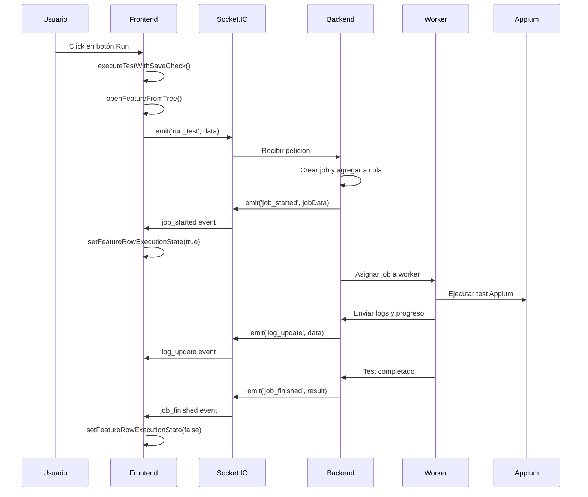

# Arquitectura General - Appium Orchestrator Web

## 📋 Visión General

**Appium Orchestrator Web** es una aplicación web completa diseñada para orquestar, monitorear y gestionar la ejecución de tests Appium en un entorno distribuido. La aplicación proporciona una interfaz unificada para la gestión de workspaces, ejecución de tests, monitoreo en tiempo real e integración con sistemas de control de versiones.

## 🏗️ Arquitectura de Alto Nivel

```
┌─────────────────────────────────────────────────────────────┐
│                    Frontend (Browser)                        │
├─────────────────────────────────────────────────────────────┤
│  ┌─────────────────┐  ┌─────────────────┐  ┌─────────────────┐ │
│  │   UI Module     │  │   Main Module   │  │  Socket Module  │ │
│  │   (ui.js)       │  │   (main.js)     │  │   (socket.js)   │ │
│  └─────────────────┘  └─────────────────┘  └─────────────────┘ │
│  ┌─────────────────┐  ┌─────────────────┐  ┌─────────────────┐ │
│  │   API Module    │  │ Progress Ind.   │  │  WireMock Mod.  │ │
│  │   (api.js)      │  │  (progress.js)  │  │  (wiremock.js)  │ │
│  └─────────────────┘  └─────────────────┘  └─────────────────┘ │
│  ┌─────────────────┐  ┌─────────────────┐  ┌─────────────────┐ │
│  │ State Manager   │  │ Event Manager   │  │ Error Utils     │ │
│  │ (state/)       │  │ (state/)       │  │ (utils/)        │ │
│  └─────────────────┘  └─────────────────┘  └─────────────────┘ │
└─────────────────────────────────────────────────────────────┘
                              │
                         ┌─────────────────┐
                         │  Socket.IO      │
                         │  Communication │
                         └─────────────────┘
                              │
┌─────────────────────────────────────────────────────────────┐
│                     Backend (Node.js)                        │
├─────────────────────────────────────────────────────────────┤
│  ┌─────────────────┐  ┌─────────────────┐  ┌─────────────────┐ │
│  │   Express       │  │   Socket.IO     │  │   Authentication│ │
│  │   Server        │  │   Manager       │  │   Manager       │ │
│  └─────────────────┘  └─────────────────┘  └─────────────────┘ │
│  ┌─────────────────┐  ┌─────────────────┐  ┌─────────────────┐ │
│  │  Core Modules   │  │  Security Mods  │  │  Service Mods   │ │
│  │  (5 managers)   │  │  (3 modules)    │  │  (2 services)   │ │
│  └─────────────────┘  └─────────────────┘  └─────────────────┘ │
│  ┌─────────────────┐  ┌─────────────────┐  ┌─────────────────┐ │
│  │ Worker Mgmt     │  │  Utils Modules  │  │  Config Module  │ │
│  │  (4 managers)   │  │  (3 utilities)  │  │  Manager        │ │
│  └─────────────────┘  └─────────────────┘  └─────────────────┘ │
└─────────────────────────────────────────────────────────────┘
                              │
                    ┌─────────────────┐
                    │   External      │
                    │   Services     │
                    └─────────────────┘
```

## 🔄 Flujo de Datos Principal

### 1. Inicialización de la Aplicación

```javascript
// main.js - Punto de entrada principal
document.addEventListener('DOMContentLoaded', () => {
  checkAuthStatus(); // 1. Verificar autenticación
});

async function checkAuthStatus() {
  const user = await getCurrentUser(); // api.js
  if (user) {
    initializeApp(); // 2. Inicializar aplicación
  }
}

async function initializeApp() {
  const socket = io(); // 3. Establecer conexión Socket.IO
  initializeSocketListeners(socket); // 4. Configurar listeners
  initializeAppControls(socket); // 5. Configurar controles
  initIdeView({
    /* 6. Inicializar IDE */
  });
}
```

### 2. Flujo de Ejecución de Tests



## 📁 Estructura del Proyecto

```
appium-orchestrator-web/
├── docs/                           # Documentación
│   ├── 01-arquitectura-general.md   # Este documento
│   ├── 02-backend/                  # Documentación backend
│   ├── 03-frontend/                 # Documentación frontend
│   ├── 04-features/                 # Documentación de features
│   ├── 05-tech-planning/            # Planificación técnica
│   │   ├── REFACTOR_PLAN.md        # Plan de refactorización
│   │   └── TESTING_PLAN.md         # Plan de testing
│   └── ...                         # Otros documentos
├── public/                         # Frontend
│   ├── index.html                  # Página principal
│   ├── css/                        # Estilos
│   │   ├── styles.css             # Estilos generales
│   │   └── ide.css                # Estilos del IDE
│   ├── js/                         # Módulos JavaScript
│   │   ├── api.js                 # API del backend
│   │   ├── main.js                # Lógica principal
│   │   ├── ui.js                  # Componentes UI
│   │   ├── socket.js              # Eventos Socket.IO
│   │   ├── progress-indicator-manager.js # Indicadores de progreso
│   │   ├── wiremock.js            # Gestión WireMock
│   │   ├── state/                 # Sistema de gestión de estado
│   │   │   ├── state-manager.js   # Gestor de estado centralizado
│   │   │   └── event-manager.js   # Sistema de eventos
│   │   └── utils/                 # Utilidades centralizadas
│   │       └── error-handling.js  # Manejo de errores
│   └── reports/                   # Reportes generados
├── src/                            # Código fuente modular
│   ├── modules/                    # Módulos del backend (17 módulos)
│   │   ├── security/              # Módulos de seguridad
│   │   │   ├── authentication.js  # Gestión OAuth 2.0
│   │   │   ├── configuration.js    # Gestión de configuración
│   │   │   └── validation.js      # Validación de entradas
│   │   ├── core/                  # Módulos centrales
│   │   │   ├── apk-manager.js     # Gestión de APKs
│   │   │   ├── branch-manager.js  # Operaciones Git
│   │   │   ├── device-manager.js  # Gestión de dispositivos
│   │   │   ├── feature-manager.js # Gestión de features
│   │   │   └── workspace-manager.js # Gestión de workspaces
│   │   ├── services/              # Módulos de servicios
│   │   │   ├── file-operations.js # Operaciones de archivos
│   │   │   └── git-operations.js  # Operaciones Git avanzadas
│   │   ├── worker-management/     # Gestión de workers
│   │   │   ├── job-queue-manager.js # Cola de trabajos
│   │   │   ├── process-manager.js  # Gestión de procesos
│   │   │   ├── resource-manager.js # Gestión de recursos
│   │   │   └── worker-pool-manager.js # Pool de workers
│   │   ├── socketio/              # Comunicación en tiempo real
│   │   │   └── socketio-manager.js # Gestión Socket.IO
│   │   └── utils/                 # Utilidades
│   │       ├── logging-utilities.js # Sistema de logging
│   │       ├── path-utilities.js   # Utilidades de rutas
│   │       └── string-utilities.js # Utilidades de strings
│   ├── js/                         # Módulos JavaScript (fuente)
│   │   ├── state/                 # State management (fuente)
│   │   │   ├── state-manager.js   # Versión fuente
│   │   │   └── event-manager.js   # Versión fuente
│   │   └── utils/                 # Utilidades (fuente)
│   │       └── error-handling.js  # Versión fuente
│   └── tests/                      # Suite de pruebas (259 tests)
│       ├── setup/                  # Configuración de testing
│       ├── phase0/                 # Tests de humo
│       ├── phase1/                 # Tests de utilidades
│       ├── phase2/                 # Tests de state management
│       ├── phase3/                 # Tests de API
│       └── server/                 # Tests de módulos backend
├── scripts/                        # Scripts de sistema
│   ├── feature-runner.sh          # Ejecutor de features
│   ├── setup-workspace.sh         # Configuración de workspace
│   ├── start-appium.sh            # Inicio de Appium
│   └── ...                        # Otros scripts
├── wiremock/                       # Configuraciones WireMock
│   └── mappings/                  # Mappings HTTP
├── server.js                       # Servidor backend (modular)
├── worker.js                       # Sistema de workers
├── ARCHITECTURE.md                 # Documentación de arquitectura modular
├── package.json                    # Dependencias
├── jest.config.js                  # Configuración Jest
├── babel.config.js                 # Configuración Babel
└── docker-compose.yml              # Configuración Docker
```

## 🔧 Componentes Principales

### Backend (Node.js + Express)

#### **server.js** - Servidor Principal (Modular)

El servidor ha sido refactorizado en una arquitectura modular de 17 componentes especializados:

- **Módulos Core (5)**: apk-manager, branch-manager, device-manager, feature-manager, workspace-manager
- **Módulos Security (3)**: authentication, configuration, validation  
- **Módulos Services (2)**: file-operations, git-operations
- **Módulos Worker Management (4)**: job-queue-manager, process-manager, resource-manager, worker-pool-manager
- **Módulos Utils (3)**: logging-utilities, path-utilities, string-utilities
- **Módulo SocketIO (1)**: socketio-manager

**Características principales:**
- **Autenticación**: Google OAuth 2.0 con AuthenticationManager
- **API REST**: Endpoints gestionados por módulos especializados
- **Socket.IO**: Comunicación en tiempo real con SocketIOManager
- **Gestión de Sesiones**: Express Session middleware
- **Arquitectura Modular**: Inyección de dependencias y responsabilidades claras

#### **worker.js** - Sistema de Workers

- **Pool de Workers**: Gestión de ejecución paralela mediante WorkerPoolManager
- **Cola de Jobs**: Sistema de cola con prioridades (JobQueueManager)
- **Integración Appium**: Comunicación con dispositivos Appium
- **Manejo de Logs**: Captura y envío de logs en tiempo real vía LoggingUtilities

### Frontend (Vanilla JavaScript)

#### **Módulo API** (`api.js`)

```javascript
// Funciones principales de API
export async function fetchFeatures() {
  /* ... */
}
export async function getFeatureContent(branch, client, feature) {
  /* ... */
}
export async function saveFeatureContent(branch, client, feature, content) {
  /* ... */
}
export async function getWorkspaceStatus(branch) {
  /* ... */
}
export async function getCurrentUser() {
  /* ... */
}
```

#### **Módulo UI** (`ui.js`)

```javascript
// Componentes principales de UI
export function initIdeView({ onSave, onCommit, onRun }) {
  /* ... */
}
export function setIdeEditorContent({ content, isReadOnly, isModified }) {
  /* ... */
}
export function renderFeatureTree(parentElement, nodes, config) {
  /* ... */
}
export function addFeatureControls(li, featureName) {
  /* ... */
}
export function switchTab(tabName) {
  /* ... */
}
```

#### **Módulo Socket** (`socket.js`)

```javascript
// Eventos principales de Socket.IO
export function runTest(socket, branch, client, feature, highPriority) {
  /* ... */
}
export function initializeSocketListeners(socket) {
  /* ... */
}
export function runSelectedTests(socket) {
  /* ... */
}
export function stopAllExecution(socket) {
  /* ... */
}
```

#### **Módulo Main** (`main.js`)

```javascript
// Orquestación principal con State Management
function initializeApp() {
  // Inicializar State Manager con estado inicial
  window.appState = new StateManager({
    activeFeature: null,
    currentUser: null,
    selectedBranch: '',
    selectedClient: '',
    isLoading: false,
    config: null,
    localDevices: [],
    lastError: null,
  });

  // Inicializar Event Manager
  window.globalEvents = new EventManager();

  // Configurar suscripciones a estado
  appState.subscribe('isLoading', updateLoadingUI);
  appState.subscribe('lastError', handleError);

  /* ... resto de inicialización ... */
}
function initializeAppControls(socket) {
  /* ... */
}
function handleSave() {
  /* ... */
}
function handleIdeRun(socket) {
  /* ... */
}
```

#### **State Manager** (`src/js/state/state-manager.js`)

```javascript
// Gestión centralizada de estado
class StateManager {
  constructor(initialState = {}) {
    this.state = { ...initialState };
    this.subscribers = new Map();
  }

  getState() {
    return { ...this.state };
  }

  setState(stateObject, options = {}) {
    const oldState = { ...this.state };
    this.state = { ...this.state, ...stateObject };

    if (!options.silent) {
      this.notifySubscribers(stateObject, oldState);
    }
  }

  subscribe(path, callback) {
    // Suscripción a cambios de estado
  }
}
```

#### **Event Manager** (`src/js/state/event-manager.js`)

```javascript
// Sistema de eventos desacoplado
class EventManager {
  constructor() {
    this.events = new Map();
  }

  emit(eventName, data) {
    // Emitir eventos a componentes suscritos
  }

  on(eventName, callback) {
    // Suscribirse a eventos
  }
}
```

#### **Error Handling Utils** (`src/js/utils/error-handling.js`)

```javascript
// Utilidades centralizadas de manejo de errores
export function handleApiError(error, context = 'API call') {
  console.error(`${context} failed:`, error);
  // Manejo estandarizado de errores
}

export function logError(message, error) {
  // Logging estructurado para errores
}

// Clases de error especializadas
export class ApiError extends Error {
  constructor(message, statusCode) {
    super(message);
    this.statusCode = statusCode;
  }
}
```

#### **Módulo Progress Indicators** (`progress-indicator-manager.js`)

```javascript
// Gestión de indicadores de progreso
class ProgressIndicatorManager {
  setCurrentJob(jobId) {
    /* ... */
  }
  setTestState(testFileName, state, jobId) {
    /* ... */
  }
  handleProgressUpdate(data) {
    /* ... */
  }
  updateEditorStateForCurrentFile() {
    /* ... */
  }
}
```

## 🌐 Eventos Socket.IO Principales

### Eventos de Backend a Frontend

```javascript
// Control de ejecución
socket.on('job_started', (data) => {
  /* ... */
});
socket.on('job_finished', (data) => {
  /* ... */
});
socket.on('log_update', (data) => {
  /* ... */
});
socket.on('progress_update', (data) => {
  /* ... */
});

// Gestión de workspaces
socket.on('workspace_ready', (data) => {
  /* ... */
});
socket.on('commit_status_update', (data) => {
  /* ... */
});

// Sistema de workers
socket.on('worker_pool_update', (slots) => {
  /* ... */
});
socket.on('queue_status_update', (status) => {
  /* ... */
});
```

### Eventos de Frontend a Backend

```javascript
// Ejecución de tests
socket.emit('run_test', { branch, client, feature, highPriority });
socket.emit('run_selected_tests', { features, branch, client });
socket.emit('stop_all_execution', {});

// Gestión de workspaces
socket.emit('prepare_workspace', { branch });
socket.emit('commit_changes', { branch, files, message });
socket.emit('push_changes', { branch });
```

## 🔄 Estados de la Aplicación

### Estados de Ejecución de Tests

```javascript
// Estados manejados por ProgressIndicatorManager
const TEST_STATES = {
  IDLE: 'idle',
  RUNNING: 'running',
  PASSED: 'passed',
  FAILED: 'failed',
  CANCELLED: 'cancelled',
};
```

### Estados de la UI

```javascript
// Estados principales de la interfaz
const UI_STATES = {
  AUTHENTICATED: 'authenticated',
  LOADING: 'loading',
  READY: 'ready',
  EXECUTING: 'executing',
  ERROR: 'error',
};
```

## 📊 Flujo de Features Completo

### 1. Gestión de Workspaces

```javascript
// Flujo completo de workspace
async function setupWorkspaceFlow() {
  // 1. Seleccionar branch
  const branch = document.getElementById('branch-select').value;

  // 2. Preparar workspace
  await prepareWorkspace(socket, branch);

  // 3. Cargar features
  await fetchFeatures();

  // 4. Actualizar estado Git
  await updateGitStatus(branch);
}
```

### 2. Ejecución de Tests con Integración IDE

```javascript
// Flujo de ejecución integrado (implementado recientemente)
async function executeTestWithSaveCheck(featureName, highPriority) {
  // 1. Verificar cambios no guardados
  if (hasUnsavedChanges()) {
    const shouldSave = confirm('¿Guardar cambios antes de ejecutar?');
    if (shouldSave) {
      const saved = await handleSave();
      if (!saved) return;
    }
  }

  // 2. Abrir feature en editor
  await openFeatureFromTree(featureName);

  // 3. Ejecutar test
  runTest(socket, branch, client, featureName, highPriority);
}
```

### 3. Monitoreo en Tiempo Real

```javascript
// Flujo de monitoreo con progress indicators
socket.on('progress_update', (data) => {
  if (window.progressIndicatorManager) {
    window.progressIndicatorManager.handleProgressUpdate(data);
    // Actualizar UI con progreso actual
    updateTestProgress(data.featureName, data.progress);
  }
});
```

## 🔒 Seguridad y Autenticación

### Google OAuth 2.0 Flow

```javascript
// Configuración de Passport
passport.use(
  new GoogleStrategy(
    {
      clientID: GOOGLE_CLIENT_ID,
      clientSecret: GOOGLE_CLIENT_SECRET,
      callbackURL: '/auth/google/callback',
      hostedDomain: GOOGLE_HOSTED_DOMAIN,
    },
    (accessToken, refreshToken, profile, done) => {
      // Validar usuario y crear sesión
    },
  ),
);
```

### Protección de Rutas

```javascript
// Middleware de autenticación
function requireAuth(req, res, next) {
  if (req.isAuthenticated()) {
    return next();
  }
  res.redirect('/login');
}
```

## 🧪 Sistema de Testing

### Infraestructura de Testing

El proyecto implementa un sistema de testing completo con Jest + Babel:

```javascript
// Configuración principal
// jest.config.js
module.exports = {
  testEnvironment: 'jsdom',
  roots: ['<rootDir>/src/tests'],
  testMatch: ['**/*.test.js'],
  setupFilesAfterEnv: ['<rootDir>/src/tests/setup/setup.js'],
};
```

### Estructura de Tests

```
src/tests/
├── setup/                    # Configuración global
│   └── setup.js             # Setup global y mocks
├── phase0/                   # Tests de humo
├── phase1/                   # Tests de utilidades
├── phase2/                   # Tests de state management
├── phase3/                   # Tests de API
└── server/                   # Tests de módulos backend
    ├── api/                  # Tests de API endpoints
    ├── auth/                 # Tests de autenticación
    ├── config/               # Tests de configuración
    ├── socket/               # Tests de Socket.IO
    ├── utils/                # Tests de utilidades
    └── worker/               # Tests de worker management
```

### Métricas de Testing

- **Total Tests**: 259 tests funcionando (100% pasando)
- **Cobertura**: 90%+ en módulos backend
- **Tiempo de ejecución**: <3 segundos
- **Mock System**: Completo con DOM, APIs, eventos y módulos
- **Compatibilidad**: 100% con sistema original post-refactorización

## 🔄 Sistema de Gestión de Estado

### Arquitectura Reactiva

El sistema implementa un patrón reactivo con:

- **State Manager**: Gestión centralizada e inmutable del estado
- **Event Manager**: Sistema pub/sub para comunicación desacoplada
- **Suscripciones**: Componentes reactivos a cambios de estado

### Flujo de Datos

```javascript
// 1. Estado centralizado
const appState = new StateManager({
  activeFeature: null,
  currentUser: null,
  isLoading: false,
});

// 2. Suscripciones reactivas
appState.subscribe('isLoading', (loading) => {
  updateUI(loading);
});

// 3. Eventos desacoplados
globalEvents.emit('feature:selected', { name: 'test.feature' });
globalEvents.on('feature:selected', (data) => {
  // Manejar selección
});
```

## 🚀 Próximos Pasos

Esta documentación general sirve como base para los documentos detallados:

1. **Backend**: Arquitectura del servidor, autenticación, eventos Socket.IO
2. **Frontend**: Cada módulo detallado con API y ejemplos
3. **Features**: Guías completas de cada funcionalidad
4. **Development**: Guías para desarrolladores nuevos

## 📖 Documentos Relacionados

- [02-backend/01-server-architecture.md](./02-backend/01-server-architecture.md)
- [03-frontend/01-module-overview.md](./03-frontend/01-module-overview.md)
- [04-features/03-test-execution.md](./04-features/03-test-execution.md)
- [05-tech-planning/REFACTOR_PLAN.md](./05-tech-planning/REFACTOR_PLAN.md)
- [05-tech-planning/TESTING_PLAN.md](./05-tech-planning/TESTING_PLAN.md)
