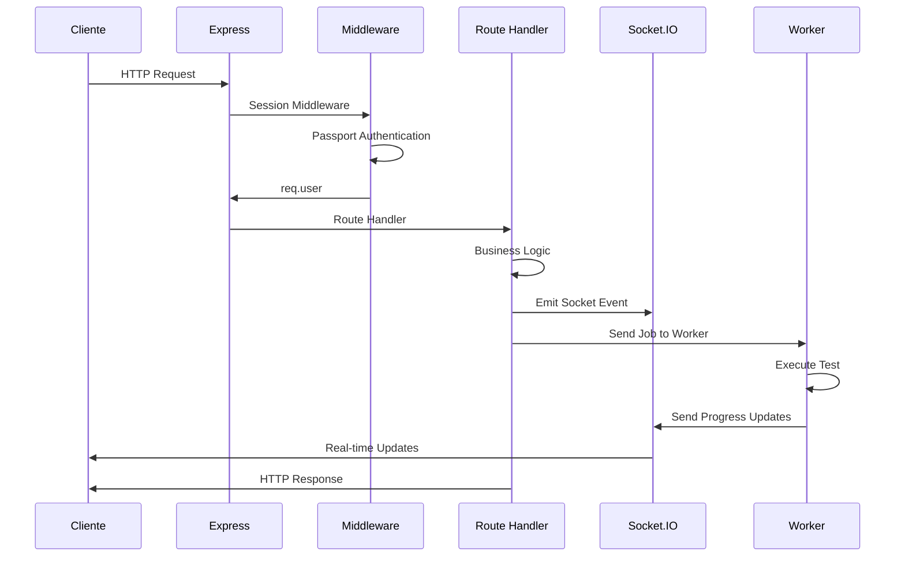

# Backend - Server Architecture

## 📋 Visión General

El backend de Appium Orchestrator Web está construido con **Node.js + Express** y sirve como el corazón de la aplicación, gestionando la autenticación, la API REST, la comunicación en tiempo real a través de Socket.IO y la orquestación de la ejecución de tests.

## 🏗️ Arquitectura del Servidor

```
┌─────────────────────────────────────────────────────────────┐
│                    Express Server                            │
├─────────────────────────────────────────────────────────────┤
│  ┌─────────────────┐  ┌─────────────────┐  ┌─────────────────┐ │
│  │   Middleware    │  │   Routes        │  │   Socket.IO     │ │
│  │   Layer         │  │   Layer         │  │   Integration  │ │
│  └─────────────────┘  └─────────────────┘  └─────────────────┘ │
│  ┌─────────────────┐  ┌─────────────────┐  ┌─────────────────┐ │
│  │   Auth          │  │   Git           │  │   File System   │ │
│  │   (Passport)    │  │   Integration   │  │   Management    │ │
│  └─────────────────┘  └─────────────────┘  └─────────────────┘ │
│  ┌─────────────────┐  ┌─────────────────┐  ┌─────────────────┐ │
│  │   Session       │  │   Worker Pool   │  │   Logger        │ │
│  │   Management    │  │   Management    │  │   System        │ │
│  └─────────────────┘  └─────────────────┘  └─────────────────┘ │
└─────────────────────────────────────────────────────────────┘
```

## 🔧 Componentes Principales

### 1. Configuración y Middleware

```javascript
// server.js - Configuración principal
const express = require('express');
const { Server } = require('socket.io');
const session = require('express-session');
const passport = require('passport');

// Configuración de sesión
const sessionMiddleware = session({
  secret: SESSION_SECRET,
  resave: false,
  saveUninitialized: false,
  cookie: { maxAge: 24 * 60 * 60 * 1000 }, // 24 horas
});

// Middleware stack
app.use(sessionMiddleware);
app.use(passport.initialize());
app.use(passport.session());
app.use(express.json());
app.use(express.static('public'));
```

### 2. Sistema de Autenticación

#### Google OAuth 2.0 Strategy

```javascript
// server.js - Configuración de Passport
passport.use(
  new GoogleStrategy(
    {
      clientID: GOOGLE_CLIENT_ID,
      clientSecret: GOOGLE_CLIENT_SECRET,
      callbackURL: '/auth/google/callback',
      hostedDomain: GOOGLE_HOSTED_DOMAIN, // Restringe al dominio de la empresa
    },
    (accessToken, refreshToken, profile, done) => {
      // El perfil contiene información del usuario
      return done(null, profile);
    },
  ),
);

// Serialización de usuario para sesiones
passport.serializeUser((user, done) => {
  done(null, user);
});

passport.deserializeUser((obj, done) => {
  done(null, obj);
});
```

#### Rutas de Autenticación

```javascript
// server.js - Rutas de autenticación
app.get(
  '/auth/google',
  passport.authenticate('google', { scope: ['profile', 'email'] }),
);

app.get(
  '/auth/google/callback',
  passport.authenticate('google', { failureRedirect: '/login' }),
  (req, res) => {
    res.redirect('/');
  },
);

app.get('/logout', (req, res) => {
  req.logout((err) => {
    res.redirect('/');
  });
});

// Middleware de protección
function requireAuth(req, res, next) {
  if (req.isAuthenticated()) {
    return next();
  }
  res.status(401).json({ error: 'No autorizado' });
}
```

### 3. API REST Endpoints

#### Gestión de Workspaces

```javascript
// server.js - Endpoints de workspace
// Obtener estado del workspace
app.get('/api/workspace/:branch/status', requireAuth, async (req, res) => {
  try {
    const { branch } = req.params;
    const status = await getWorkspaceStatus(branch);
    res.json(status);
  } catch (error) {
    res.status(500).json({ error: error.message });
  }
});

// Preparar workspace
app.post('/api/workspace/:branch/prepare', requireAuth, async (req, res) => {
  try {
    const { branch } = req.params;
    const result = await prepareWorkspace(branch);
    res.json(result);
  } catch (error) {
    res.status(500).json({ error: error.message });
  }
});
```

#### Gestión de Features

```javascript
// server.js - Endpoints de features
// Obtener lista de features
app.get('/api/features/:branch/:client', requireAuth, async (req, res) => {
  try {
    const { branch, client } = req.params;
    const features = await getFeatureList(branch, client);
    res.json(features);
  } catch (error) {
    res.status(500).json({ error: error.message });
  }
});

// Obtener contenido de un feature
app.get(
  '/api/features/:branch/:client/:feature',
  requireAuth,
  async (req, res) => {
    try {
      const { branch, client, feature } = req.params;
      const content = await getFeatureContent(branch, client, feature);
      res.json({ content });
    } catch (error) {
      res.status(500).json({ error: error.message });
    }
  },
);

// Guardar cambios en un feature
app.put(
  '/api/features/:branch/:client/:feature',
  requireAuth,
  async (req, res) => {
    try {
      const { branch, client, feature } = req.params;
      const { content } = req.body;
      const result = await saveFeatureContent(branch, client, feature, content);
      res.json(result);
    } catch (error) {
      res.status(500).json({ error: error.message });
    }
  },
);
```

#### Gestión Git

```javascript
// server.js - Endpoints de Git
// Obtener estado de commits
app.get('/api/git/:branch/commit-status', requireAuth, async (req, res) => {
  try {
    const { branch } = req.params;
    const status = await getCommitStatus(branch);
    res.json(status);
  } catch (error) {
    res.status(500).json({ error: error.message });
  }
});

// Realizar commit
app.post('/api/git/:branch/commit', requireAuth, async (req, res) => {
  try {
    const { branch } = req.params;
    const { files, message } = req.body;
    const result = await commitChanges(branch, files, message);
    res.json(result);
  } catch (error) {
    res.status(500).json({ error: error.message });
  }
});

// Push changes
app.post('/api/git/:branch/push', requireAuth, async (req, res) => {
  try {
    const { branch } = req.params;
    const result = await pushChanges(branch);
    res.json(result);
  } catch (error) {
    res.status(500).json({ error: error.message });
  }
});
```

### 4. Socket.IO Integration

#### Configuración de Socket.IO con Session

```javascript
// server.js - Integración de Socket.IO con sesiones
io.use((socket, next) => {
  sessionMiddleware(socket.request, {}, next);
});

io.use((socket, next) => {
  passport.initialize()(socket.request, {}, next);
});

io.use((socket, next) => {
  passport.session()(socket.request, {}, next);

  if (socket.request.user) {
    socket.userId = socket.request.user.id;
    next();
  } else {
    next(new Error('No autorizado'));
  }
});
```

#### Eventos de Conexión

```javascript
// server.js - Manejo de conexiones Socket.IO
io.on('connection', (socket) => {
  console.log(`Usuario conectado: ${socket.userId}`);

  // Enviar estado inicial
  socket.emit('init', {
    user: socket.request.user,
    config: getAppConfig(),
  });

  // Manejar desconexión
  socket.on('disconnect', () => {
    console.log(`Usuario desconectado: ${socket.userId}`);
  });
});
```

### 5. Sistema de Worker Pool

#### Gestión de Workers

```javascript
// server.js - Sistema de workers
const workerPool = new Map();
const jobQueue = [];
const maxWorkers = 5;

// Función para crear worker
function createWorker(slotId) {
  const worker = fork('./worker.js', [slotId]);

  worker.on('message', (msg) => {
    switch (msg.type) {
      case 'log':
        io.emit('log_update', msg.data);
        break;
      case 'progress':
        io.emit('progress_update', msg.data);
        break;
      case 'finished':
        handleJobFinished(msg.data);
        break;
      case 'error':
        io.emit('job_error', msg.data);
        break;
    }
  });

  worker.on('exit', (code) => {
    workerPool.delete(slotId);
    io.emit('worker_pool_update', getWorkerPoolStatus());
  });

  return worker;
}

// Función para asignar jobs
function assignJob(job) {
  const availableSlot = findAvailableWorkerSlot();
  if (availableSlot !== null) {
    const worker = createWorker(availableSlot);
    workerPool.set(availableSlot, worker);
    worker.send(job);
    return true;
  }
  return false;
}
```

### 6. Manejo de Jobs

#### Recepción y Procesamiento de Jobs

```javascript
// server.js - Manejo de jobs de ejecución
socket.on('run_test', (data) => {
  const job = {
    id: generateJobId(),
    type: 'single',
    branch: data.branch,
    client: data.client,
    feature: data.feature,
    highPriority: data.highPriority || false,
    deviceSerial: data.deviceSerial,
    userId: socket.userId,
    timestamp: Date.now(),
  };

  // Agregar a la cola o ejecutar directamente
  if (!assignJob(job)) {
    jobQueue.push(job);
    io.emit('queue_status_update', getQueueStatus());
  }

  // Notificar inicio del job
  io.emit('job_started', {
    jobId: job.id,
    slotId: getWorkerSlotForJob(job.id),
    featureName: job.feature,
    userId: job.userId,
  });
});

socket.on('run_selected_tests', (data) => {
  const jobs = data.features.map((feature) => ({
    id: generateJobId(),
    type: 'batch',
    branch: data.branch,
    client: data.client,
    feature: feature,
    highPriority: data.highPriority || false,
    deviceSerial: data.deviceSerial,
    userId: socket.userId,
    timestamp: Date.now(),
  }));

  // Procesar cada job
  jobs.forEach((job) => {
    if (!assignJob(job)) {
      jobQueue.push(job);
    }
  });

  io.emit('queue_status_update', getQueueStatus());
});
```

### 7. Sistema de Logging

#### Logger Centralizado

```javascript
// server.js - Sistema de logging
const fs = require('fs');
const path = require('path');

function logToFile(message, level = 'info') {
  const timestamp = new Date().toISOString();
  const logMessage = `[${timestamp}] [${level.toUpperCase()}] ${message}\n`;

  fs.appendFile(path.join(__dirname, 'logs', 'app.log'), logMessage, (err) => {
    if (err) console.error('Error writing to log file:', err);
  });
}

// Middleware de logging para requests
app.use((req, res, next) => {
  logToFile(`${req.method} ${req.path} - ${req.ip}`, 'access');
  next();
});
```

### 8. Manejo de Errores

#### Error Handler Global

```javascript
// server.js - Manejo de errores
app.use((err, req, res, next) => {
  logToFile(`Error: ${err.message}`, 'error');

  if (err.name === 'ValidationError') {
    return res.status(400).json({ error: err.message });
  }

  if (err.name === 'UnauthorizedError') {
    return res.status(401).json({ error: 'No autorizado' });
  }

  res.status(500).json({ error: 'Error interno del servidor' });
});

// Manejo de errores asíncronos no capturados
process.on('uncaughtException', (err) => {
  logToFile(`Uncaught Exception: ${err.message}`, 'error');
  process.exit(1);
});

process.on('unhandledRejection', (reason, promise) => {
  logToFile(`Unhandled Rejection at: ${promise}, reason: ${reason}`, 'error');
});
```

### 9. Configuración y Variables de Entorno

#### Variables de Entorno Requeridas

```javascript
// server.js - Configuración de entorno
require('dotenv').config();

const {
  GOOGLE_CLIENT_ID,
  GOOGLE_CLIENT_SECRET,
  SESSION_SECRET,
  GOOGLE_HOSTED_DOMAIN,
  PORT = 3000,
  NODE_ENV = 'development',
} = process.env;

// Validación de variables requeridas
const requiredEnvVars = [
  'GOOGLE_CLIENT_ID',
  'GOOGLE_CLIENT_SECRET',
  'SESSION_SECRET',
  'GOOGLE_HOSTED_DOMAIN',
];

requiredEnvVars.forEach((varName) => {
  if (!process.env[varName]) {
    console.error(`Error: La variable de entorno ${varName} es requerida`);
    process.exit(1);
  }
});
```

### 10. Inicialización del Servidor

#### Arranque del Servidor

```javascript
// server.js - Inicialización
const server = http.createServer(app);
const io = new Server(server);

// Integración de Socket.IO con Express
app.set('io', io);

// Ruta principal
app.get('/', (req, res) => {
  if (req.isAuthenticated()) {
    res.sendFile(path.join(__dirname, 'public', 'index.html'));
  } else {
    res.redirect('/login');
  }
});

// Iniciar servidor
server.listen(PORT, () => {
  logToFile(`Servidor iniciado en puerto ${PORT}`, 'info');
  console.log(`Servidor corriendo en http://localhost:${PORT}`);
});

// Manejo de cierre graceful
process.on('SIGTERM', () => {
  logToFile('Recibida señal SIGTERM, cerrando servidor...', 'info');
  server.close(() => {
    logToFile('Servidor cerrado', 'info');
    process.exit(0);
  });
});
```

## 🔄 Flujo Completo de una Petición



## 📊 Monitoreo y Métricas

#### Health Check Endpoint

```javascript
// server.js - Health check
app.get('/health', (req, res) => {
  const health = {
    status: 'healthy',
    timestamp: new Date().toISOString(),
    uptime: process.uptime(),
    memory: process.memoryUsage(),
    workers: workerPool.size,
    queue: jobQueue.length,
  };

  res.json(health);
});
```

## 📖 Documentos Relacionados

- [02-backend/02-authentication-system.md](./02-authentication-system.md)
- [02-backend/03-socket-events.md](./03-socket-events.md)
- [02-backend/04-worker-system.md](./04-worker-system.md)
- [03-frontend/01-module-overview.md](../03-frontend/01-module-overview.md)
