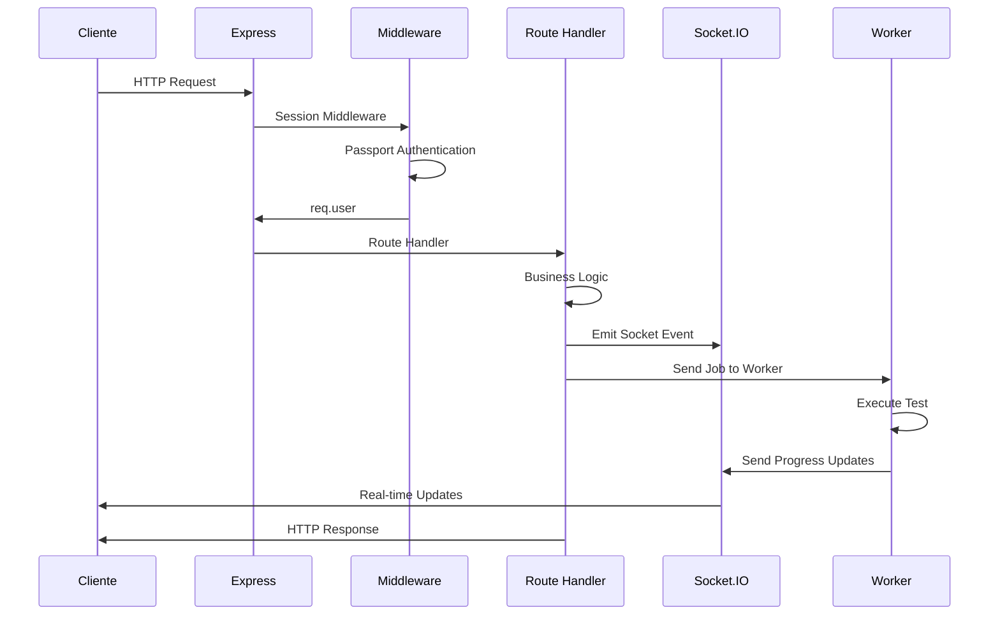

# Backend - Server Architecture

## 📋 Visión General

El backend de Appium Orchestrator Web está construido con **Node.js + Express** y sirve como el corazón de la aplicación. Originalmente un monolito de 2,232 líneas, ha sido refactorizado en una **arquitectura modular de 17 componentes especializados**, manteniendo el 100% de funcionalidad y compatibilidad.

### 🔄 Transformación Arquitectónica

- **Antes**: server.js monolítico (2,232 líneas)
- **Ahora**: Arquitectura modular con 17 componentes especializados
- **Tests**: 259 tests (100% pasando)
- **Compatibilidad**: 100% mantenida

## 🏗️ Arquitectura Modular del Servidor

```
┌─────────────────────────────────────────────────────────────┐
│                    Express Server                            │
├─────────────────────────────────────────────────────────────┤
│  ┌─────────────────┐  ┌─────────────────┐  ┌─────────────────┐ │
│  │   Security      │  │   Core API      │  │   Services      │ │
│  │   Modules       │  │   Modules       │  │   Modules       │ │
│  │  (3 modules)    │  │  (5 managers)    │  │  (2 services)   │ │
│  └─────────────────┘  └─────────────────┘  └─────────────────┘ │
│  ┌─────────────────┐  ┌─────────────────┐  ┌─────────────────┐ │
│  │   Worker Mgmt   │  │   Socket.IO     │  │   Utils         │ │
│  │   Modules       │  │   Manager       │  │   Modules       │ │
│  │  (4 managers)   │  │                 │  │  (3 utilities)  │ │
│  └─────────────────┘  └─────────────────┘  └─────────────────┘ │
└─────────────────────────────────────────────────────────────┘
```

### 📦 Estructura de Módulos

```
src/modules/
├── security/                 # Módulos de Seguridad (3)
│   ├── authentication.js    # OAuth 2.0 + Passport
│   ├── configuration.js      # Variables de entorno
│   └── validation.js        # Validación de entradas
├── core/                     # Módulos Centrales (5)
│   ├── apk-manager.js       # Gestión de APKs
│   ├── branch-manager.js    # Operaciones Git
│   ├── device-manager.js    # Gestión de dispositivos
│   ├── feature-manager.js   # Gestión de features
│   └── workspace-manager.js # Gestión de workspaces
├── services/                # Módulos de Servicios (2)
│   ├── file-operations.js   # Operaciones de archivos
│   └── git-operations.js    # Operaciones Git avanzadas
├── worker-management/       # Gestión de Workers (4)
│   ├── job-queue-manager.js # Cola de trabajos
│   ├── process-manager.js   # Gestión de procesos
│   ├── resource-manager.js  # Gestión de recursos
│   └── worker-pool-manager.js # Pool de workers
├── socketio/                # Comunicación en Tiempo Real (1)
│   └── socketio-manager.js  # Gestión Socket.IO
└── utils/                   # Utilidades (3)
    ├── logging-utilities.js # Sistema de logging
    ├── path-utilities.js    # Utilidades de rutas
    └── string-utilities.js # Utilidades de strings
```

## 🔧 Componentes Principales

### 1. Configuración y Middleware (Modular)

```javascript
// server.js - Configuración principal con módulos
const express = require('express');
const { Server } = require('socket.io');
const session = require('express-session');

// Importar módulos especializados
const AuthenticationManager = require('./src/modules/security/authentication');
const ConfigurationManager = require('./src/modules/security/configuration');
const ValidationManager = require('./src/modules/security/validation');
const SocketIOManager = require('./src/modules/socketio/socketio-manager');

// Inicializar gestores de configuración
const configManager = new ConfigurationManager();
const validationManager = new ValidationManager();
const authManager = new AuthenticationManager(configManager, validationManager);

// Configuración de sesión usando ConfigurationManager
const sessionMiddleware = session({
  secret: configManager.get('SESSION_SECRET'),
  resave: false,
  saveUninitialized: false,
  cookie: { maxAge: 24 * 60 * 60 * 1000 }, // 24 horas
});

// Middleware stack modular
app.use(sessionMiddleware);
app.use(authManager.initialize());
app.use(authManager.session());
app.use(express.json());
app.use(express.static('public'));
```

### 2. Sistema de Autenticación (Modular)

#### AuthenticationManager

```javascript
// src/modules/security/authentication.js - Gestor de autenticación
class AuthenticationManager {
  constructor(configManager, validationManager) {
    this.configManager = configManager;
    this.validationManager = validationManager;
    this.setupGoogleStrategy();
  }

  setupGoogleStrategy() {
    const GoogleStrategy = require('passport-google-oauth20').Strategy;
    
    passport.use(
      new GoogleStrategy(
        {
          clientID: this.configManager.get('GOOGLE_CLIENT_ID'),
          clientSecret: this.configManager.get('GOOGLE_CLIENT_SECRET'),
          callbackURL: '/auth/google/callback',
          hostedDomain: this.configManager.get('GOOGLE_HOSTED_DOMAIN'),
        },
        (accessToken, refreshToken, profile, done) => {
          // Validar perfil usando ValidationManager
          if (this.validationManager.validateUserProfile(profile)) {
            return done(null, profile);
          }
          return done(new Error('Invalid user profile'));
        },
      ),
    );
  }

  initialize() {
    return passport.initialize();
  }

  session() {
    return passport.session();
  }

  authenticate() {
    return passport.authenticate('google', { scope: ['profile', 'email'] });
  }
}
```

#### Rutas de Autenticación

```javascript
// server.js - Rutas de autenticación
app.get(
  '/auth/google',
  passport.authenticate('google', { scope: ['profile', 'email'] }),
);

app.get(
  '/auth/google/callback',
  passport.authenticate('google', { failureRedirect: '/login' }),
  (req, res) => {
    res.redirect('/');
  },
);

app.get('/logout', (req, res) => {
  req.logout((err) => {
    res.redirect('/');
  });
});

// Middleware de protección
function requireAuth(req, res, next) {
  if (req.isAuthenticated()) {
    return next();
  }
  res.status(401).json({ error: 'No autorizado' });
}
```

### 3. API REST Endpoints (Modular)

#### Gestión de Workspaces con WorkspaceManager

```javascript
// server.js - Endpoints de workspace modularizados
const WorkspaceManager = require('./src/modules/core/workspace-manager');
const workspaceManager = new WorkspaceManager(configManager, validationManager);

// Middleware de autenticación modular
function requireAuth(req, res, next) {
  if (req.isAuthenticated()) {
    return next();
  }
  res.status(401).json({ error: 'No autorizado' });
}

// Obtener estado del workspace
app.get('/api/workspace/:branch/status', requireAuth, async (req, res) => {
  try {
    const { branch } = req.params;
    const status = await workspaceManager.getWorkspaceStatus(branch);
    res.json(status);
  } catch (error) {
    res.status(500).json({ error: error.message });
  }
});

// Preparar workspace
app.post('/api/workspace/:branch/prepare', requireAuth, async (req, res) => {
  try {
    const { branch } = req.params;
    const result = await workspaceManager.prepareWorkspace(branch);
    res.json(result);
  } catch (error) {
    res.status(500).json({ error: error.message });
  }
});
```

#### Gestión de Features

```javascript
// server.js - Endpoints de features
// Obtener lista de features
app.get('/api/features/:branch/:client', requireAuth, async (req, res) => {
  try {
    const { branch, client } = req.params;
    const features = await getFeatureList(branch, client);
    res.json(features);
  } catch (error) {
    res.status(500).json({ error: error.message });
  }
});

// Obtener contenido de un feature
app.get(
  '/api/features/:branch/:client/:feature',
  requireAuth,
  async (req, res) => {
    try {
      const { branch, client, feature } = req.params;
      const content = await getFeatureContent(branch, client, feature);
      res.json({ content });
    } catch (error) {
      res.status(500).json({ error: error.message });
    }
  },
);

// Guardar cambios en un feature
app.put(
  '/api/features/:branch/:client/:feature',
  requireAuth,
  async (req, res) => {
    try {
      const { branch, client, feature } = req.params;
      const { content } = req.body;
      const result = await saveFeatureContent(branch, client, feature, content);
      res.json(result);
    } catch (error) {
      res.status(500).json({ error: error.message });
    }
  },
);
```

#### Gestión Git

```javascript
// server.js - Endpoints de Git
// Obtener estado de commits
app.get('/api/git/:branch/commit-status', requireAuth, async (req, res) => {
  try {
    const { branch } = req.params;
    const status = await getCommitStatus(branch);
    res.json(status);
  } catch (error) {
    res.status(500).json({ error: error.message });
  }
});

// Realizar commit
app.post('/api/git/:branch/commit', requireAuth, async (req, res) => {
  try {
    const { branch } = req.params;
    const { files, message } = req.body;
    const result = await commitChanges(branch, files, message);
    res.json(result);
  } catch (error) {
    res.status(500).json({ error: error.message });
  }
});

// Push changes
app.post('/api/git/:branch/push', requireAuth, async (req, res) => {
  try {
    const { branch } = req.params;
    const result = await pushChanges(branch);
    res.json(result);
  } catch (error) {
    res.status(500).json({ error: error.message });
  }
});
```

### 4. Socket.IO Integration (Modular)

#### SocketIOManager

```javascript
// server.js - Integración de Socket.IO modularizada
const SocketIOManager = require('./src/modules/socketio/socketio-manager');
const socketIOManager = new SocketIOManager(configManager, validationManager);

// Configuración de Socket.IO con sesiones y autenticación
io.use((socket, next) => {
  sessionMiddleware(socket.request, {}, next);
});

io.use((socket, next) => {
  authManager.initialize()(socket.request, {}, next);
});

io.use((socket, next) => {
  authManager.session()(socket.request, {}, next);

  if (socket.request.user) {
    socket.userId = socket.request.user.id;
    next();
  } else {
    next(new Error('No autorizado'));
  }
});

// Eventos de conexión gestionados por SocketIOManager
io.on('connection', (socket) => {
  console.log(`Usuario conectado: ${socket.userId}`);

  // Enviar estado inicial usando SocketIOManager
  socketIOManager.sendInitialState(socket, {
    user: socket.request.user,
    config: configManager.getAppConfig(),
  });

  // Manejar eventos específicos de la aplicación
  socketIOManager.handleConnection(socket);

  // Manejar desconexión
  socket.on('disconnect', () => {
    console.log(`Usuario desconectado: ${socket.userId}`);
    socketIOManager.handleDisconnection(socket);
  });
});
```

### 5. Sistema de Worker Pool (Modular)

#### WorkerPoolManager y JobQueueManager

```javascript
// server.js - Sistema de workers modularizado
const WorkerPoolManager = require('./src/modules/worker-management/worker-pool-manager');
const JobQueueManager = require('./src/modules/worker-management/job-queue-manager');
const ProcessManager = require('./src/modules/worker-management/process-manager');
const ResourceManager = require('./src/modules/worker-management/resource-manager');

// Inicializar gestores de workers
const workerPoolManager = new WorkerPoolManager(
  configManager,
  validationManager,
  processManager,
  jobQueueManager,
);
const jobQueueManager = new JobQueueManager(configManager, validationManager);
const processManager = new ProcessManager(configManager, validationManager);
const resourceManager = new ResourceManager(configManager, validationManager);

// El WorkerPoolManager gestiona automáticamente:
// - Creación y destrucción de workers
// - Asignación de jobs a workers disponibles
// - Monitoreo de recursos y memoria
// - Limpieza de procesos zombies

// Función simplificada para asignar jobs
async function assignJob(job) {
  const success = await workerPoolManager.assignJob(job);
  if (!success) {
    await jobQueueManager.addToQueue(job);
    return false;
  }
  return true;
}
```

### 6. Manejo de Jobs

#### Recepción y Procesamiento de Jobs

```javascript
// server.js - Manejo de jobs de ejecución
socket.on('run_test', (data) => {
  const job = {
    id: generateJobId(),
    type: 'single',
    branch: data.branch,
    client: data.client,
    feature: data.feature,
    highPriority: data.highPriority || false,
    deviceSerial: data.deviceSerial,
    userId: socket.userId,
    timestamp: Date.now(),
  };

  // Agregar a la cola o ejecutar directamente
  if (!assignJob(job)) {
    jobQueue.push(job);
    io.emit('queue_status_update', getQueueStatus());
  }

  // Notificar inicio del job
  io.emit('job_started', {
    jobId: job.id,
    slotId: getWorkerSlotForJob(job.id),
    featureName: job.feature,
    userId: job.userId,
  });
});

socket.on('run_selected_tests', (data) => {
  const jobs = data.features.map((feature) => ({
    id: generateJobId(),
    type: 'batch',
    branch: data.branch,
    client: data.client,
    feature: feature,
    highPriority: data.highPriority || false,
    deviceSerial: data.deviceSerial,
    userId: socket.userId,
    timestamp: Date.now(),
  }));

  // Procesar cada job
  jobs.forEach((job) => {
    if (!assignJob(job)) {
      jobQueue.push(job);
    }
  });

  io.emit('queue_status_update', getQueueStatus());
});
```

### 7. Sistema de Logging (Modular)

#### LoggingUtilities

```javascript
// server.js - Sistema de logging modularizado
const LoggingUtilities = require('./src/modules/utils/logging-utilities');
const loggingUtilities = new LoggingUtilities(configManager);

// El LoggingUtilities gestiona:
// - Logging estructurado con niveles (info, warn, error, debug)
// - Rotación de archivos de log
// - Logging en consola y archivo
// - Contexto de usuario y request
// - Formatos JSON y texto plano

// Logging estructurado con contexto
function logWithContext(message, level = 'info', context = {}) {
  loggingUtilities.log(message, level, {
    ...context,
    timestamp: new Date().toISOString(),
    userId: req.user?.id,
    requestPath: req.path,
    requestMethod: req.method,
    ip: req.ip,
  });
}

// Middleware de logging para requests
app.use((req, res, next) => {
  logWithContext(`${req.method} ${req.path}`, 'access', {
    userAgent: req.get('User-Agent'),
    ip: req.ip,
    userId: req.user?.id,
  });
  next();
});
```

### 8. Manejo de Errores

#### Error Handler Global

```javascript
// server.js - Manejo de errores
app.use((err, req, res, next) => {
  logToFile(`Error: ${err.message}`, 'error');

  if (err.name === 'ValidationError') {
    return res.status(400).json({ error: err.message });
  }

  if (err.name === 'UnauthorizedError') {
    return res.status(401).json({ error: 'No autorizado' });
  }

  res.status(500).json({ error: 'Error interno del servidor' });
});

// Manejo de errores asíncronos no capturados
process.on('uncaughtException', (err) => {
  logToFile(`Uncaught Exception: ${err.message}`, 'error');
  process.exit(1);
});

process.on('unhandledRejection', (reason, promise) => {
  logToFile(`Unhandled Rejection at: ${promise}, reason: ${reason}`, 'error');
});
```

### 9. Configuración y Variables de Entorno

#### Variables de Entorno Requeridas

```javascript
// server.js - Configuración de entorno
require('dotenv').config();

const {
  GOOGLE_CLIENT_ID,
  GOOGLE_CLIENT_SECRET,
  SESSION_SECRET,
  GOOGLE_HOSTED_DOMAIN,
  PORT = 3000,
  NODE_ENV = 'development',
} = process.env;

// Validación de variables requeridas
const requiredEnvVars = [
  'GOOGLE_CLIENT_ID',
  'GOOGLE_CLIENT_SECRET',
  'SESSION_SECRET',
  'GOOGLE_HOSTED_DOMAIN',
];

requiredEnvVars.forEach((varName) => {
  if (!process.env[varName]) {
    console.error(`Error: La variable de entorno ${varName} es requerida`);
    process.exit(1);
  }
});
```

### 10. Inicialización del Servidor

#### Arranque del Servidor

```javascript
// server.js - Inicialización
const server = http.createServer(app);
const io = new Server(server);

// Integración de Socket.IO con Express
app.set('io', io);

// Ruta principal
app.get('/', (req, res) => {
  if (req.isAuthenticated()) {
    res.sendFile(path.join(__dirname, 'public', 'index.html'));
  } else {
    res.redirect('/login');
  }
});

// Iniciar servidor
server.listen(PORT, () => {
  logToFile(`Servidor iniciado en puerto ${PORT}`, 'info');
  console.log(`Servidor corriendo en http://localhost:${PORT}`);
});

// Manejo de cierre graceful
process.on('SIGTERM', () => {
  logToFile('Recibida señal SIGTERM, cerrando servidor...', 'info');
  server.close(() => {
    logToFile('Servidor cerrado', 'info');
    process.exit(0);
  });
});
```

## 🔄 Flujo Completo de una Petición



## 📊 Monitoreo y Métricas (Modular)

#### Health Check Endpoint

```javascript
// server.js - Health check con métricas modulares
app.get('/health', async (req, res) => {
  const health = {
    status: 'healthy',
    timestamp: new Date().toISOString(),
    uptime: process.uptime(),
    memory: process.memoryUsage(),
    
    // Métricas de módulos
    workers: await workerPoolManager.getPoolStatus(),
    queue: await jobQueueManager.getQueueStatus(),
    resources: await resourceManager.getResourceUsage(),
    config: await configManager.getHealthStatus(),
    
    // Sistema general
    version: require('./package.json').version,
    environment: process.env.NODE_ENV,
  };

  res.json(health);
});
```

## 💡 Beneficios de la Arquitectura Modular

### 🔧 Mantenibilidad
- **Separación de responsabilidades**: Cada módulo tiene una función clara
- **Código más limpio**: 2,232 líneas distribuidas en 17 módulos especializados
- **Depuración simplificada**: Los errores se aíslan en módulos específicos

### 🚀 Rendimiento
- **Carga bajo demanda**: Los módulos se inicializan solo cuando se necesitan
- **Optimización de recursos**: Mejor gestión de memoria y CPU
- **Inyección de dependencias**: Permite testing y mockeo fácil

### 🧪 Testing
- **Tests específicos**: Cada módulo tiene sus propias pruebas unitarias
- **Mocking simplificado**: Los módulos pueden ser mockeados independientemente
- **259 tests**: Cobertura completa del sistema modularizado

### 🔄 Escalabilidad
- **Fácil extensión**: Nuevas funcionalidades se añaden como módulos
- **Reutilización**: Los módulos pueden ser usados en otros proyectos
- **Desacoplamiento**: Los cambios en un módulo no afectan a otros

## 📖 Documentos Relacionados

- [ARCHITECTURE.md](../../ARCHITECTURE.md) - Documentación completa de la arquitectura modular
- [02-backend/02-authentication-system.md](./02-authentication-system.md)
- [02-backend/03-socket-events.md](./03-socket-events.md)
- [02-backend/04-worker-system.md](./04-worker-system.md)
- [03-frontend/01-module-overview.md](../03-frontend/01-module-overview.md)
