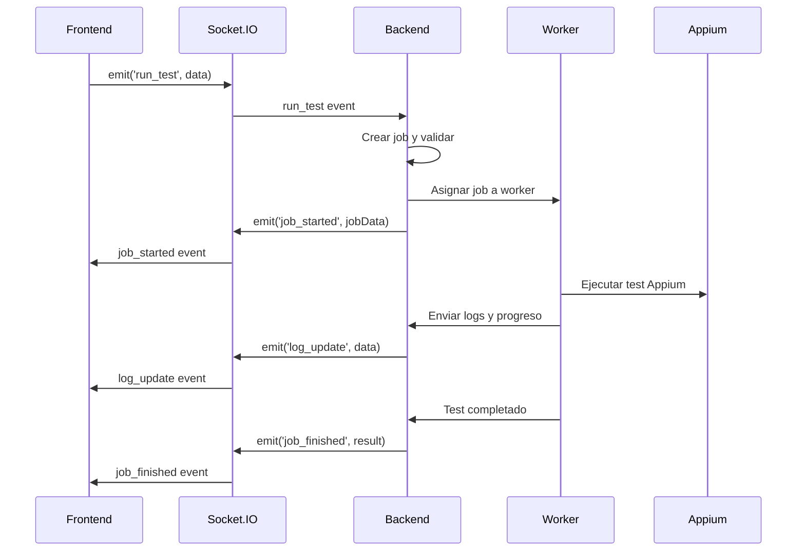

# Backend - Eventos Socket.IO

## 📋 Visión General

El sistema de comunicación en tiempo real de Appium Orchestrator Web está implementado utilizando **Socket.IO**, permitiendo una comunicación bidireccional eficiente entre el frontend y el backend. Este sistema es crucial para la ejecución de tests, monitoreo de progreso, y actualizaciones en tiempo real del estado de la aplicación.

## 🏗️ Arquitectura de Comunicación

### 1. Configuración del Servidor Socket.IO

```javascript
// server.js - Inicialización del gestor Socket.IO
const socketIOManager = new SocketIOManager(
  authManager,
  workerPoolManager,
  jobQueueManager,
  configManager,
  validationManager,
);

socketIOManager.initialize(
  server,
  authManager.getSessionMiddleware(),
  authManager.getPassport(),
);

const io = socketIOManager.getIO();
```

El `SocketIOManager` centraliza la configuración de CORS, la reutilización de sesiones Express y la verificación de autenticación. Cuando `AuthenticationManager` se ejecuta en modo desarrollo, el manager adjunta automáticamente un usuario de ejemplo, permitiendo probar la UI sin OAuth.

### 2. Middleware de Autenticación para Socket.IO

```javascript
// src/modules/socketio/socketio-manager.js - Autenticación condicional
if (this.authenticationManager.isAuthenticationEnabled()) {
  this.io.use(wrap(passport.initialize()));
  this.io.use(wrap(passport.session()));

  this.io.use((socket, next) => {
    if (socket.request.user) {
      next();
    } else {
      next(new Error('unauthorized'));
    }
  });
} else {
  // Modo desarrollo: adjunta usuario de sandbox
  this.io.use((socket, next) => {
    socket.request.user = this.configManager.getDevelopmentUser();
    next();
  });
}
```

## 📡 Eventos Principales

### 1. Eventos de Control de Ejecución y Inspector

#### Inicio de Test Individual

```javascript
// src/modules/socketio/socketio-manager.js - Evento run_test
handleRunTest(socket) {
  socket.on('run_test', (data) => {
    console.log('--- DEBUG: Datos recibidos en run_test ---', data);

    if (data.record) {
      this.handleRecordAndVerify(socket, data, data.persistentWorkspace);
    } else {
      const job = {
        ...data,
        persistentWorkspace: data.persistentWorkspace,
      };

      this.jobQueueManager.addJob(job);
      this.emitLogUpdate({
        logLine: `--- 📋 Petición de ejecución para '${data.feature}' encolada. ---\n`,
      });
    }
  });
}
```

El manager añade los trabajos a la cola mediante `JobQueueManager.addJob`, que se encarga de generar el identificador incremental, persistir el estado `queued` y disparar `processQueue()` para intentar ejecutar el trabajo inmediatamente.

#### Ejecución de Tests por Lotes

```javascript
// src/modules/socketio/socketio-manager.js - Evento run_batch
handleRunBatch(socket) {
  socket.on('run_batch', (data) => {
    const { features, ...commonJobProps } = data;
    let count = 0;

    features.forEach((feature) => {
      this.jobQueueManager.addJob({
        ...commonJobProps,
        feature,
        persistentWorkspace: data.persistentWorkspace,
      });
      count++;
    });

    this.emitLogUpdate({
      logLine: `--- 📦 ${count} Tests agregados a la cola para ejecución batch. ---\n`,
    });
    this.broadcastQueueStatus();
  });
}
```

Los eventos de control adicionales (`stop_all_execution`, `cancel_job`, `prepare_workspace`, etc.) se encapsulan en métodos similares, lo que mantiene la superficie del servidor limpia y permite reutilizar la lógica de logging y métricas en un sólo lugar.

#### Gestión de sesiones Appium

El `SocketIOManager` y el `WorkerPoolManager` cooperan para exponer el estado de las sesiones Appium al inspector. Durante la ejecución:

- Los workers emiten `APPIUM_PORT_READY` cuando el servidor Appium local está disponible. Si el worker es persistente y todavía no tiene una sesión real, se registra una sesión virtual (`persistent-<id>-<port>`) para que pueda adjuntarse desde el inspector tras un refresh.
- Cuando WebdriverIO crea o adjunta una sesión (`APPIUM_SESSION_STARTED`), `WorkerPoolManager.updateWorkerSession()` actualiza `appiumSessionId` y emite `worker_session_updated`. El inspector consume este evento para refrescar la lista sin recrear el worker.
- Al terminar o al recibir `APPIUM_SESSION_ENDED`, `clearWorkerSession()` limpia el estado y emite `worker_session_cleared`.

El listado disponible en `/api/inspector/sessions` utiliza `getAppiumSessions()`, que ahora:

- Acepta estados `busy`, `ready` (y legado `running`) para contemplar workers activos o en espera.
- Amplía el límite de elementos a 200 nodos al inspeccionar (`/inspect`), cubriendo overlays y popups complejos.
- Mantiene la sesión Appium viva con `newCommandTimeout = 0` al adjuntarse a workers persistentes, evitando cierres prematuros por inactividad.
- Expone el endpoint `POST /api/inspector/:sessionId/type` para enviar texto a campos `EditText`. Al completarse, se emite `inspector_text_entered` para mantener la UI sincronizada.
- La interacción sobre `EditText` se realiza de forma nativa (tap + clear + set/add value), por lo que no depende de `executeScript` y funciona en contextos sin WebView.

#### Detención de Ejecución

```javascript
// server.js - Manejo de stop_all_execution
socket.on('stop_all_execution', () => {
  console.log(`[${socket.userName}] Solicitando detener toda ejecución`);

  // Limpiar cola de jobs pendientes
  jobQueue.length = 0;

  // Detener workers activos
  workerPool.forEach((worker, slotId) => {
    worker.send({ type: 'stop' });
  });

  // Notificar detención
  io.emit('execution_stopped', {
    message: 'Ejecución detenida por usuario',
    timestamp: Date.now(),
    userId: socket.userId,
  });

  // Actualizar estados
  io.emit('queue_status_update', getQueueStatus());
  io.emit('worker_pool_update', getWorkerPoolStatus());
});
```

### 2. Eventos de Gestión de Workspaces

#### Preparación de Workspace

```javascript
// server.js - Manejo de prepare_workspace
socket.on('prepare_workspace', (data) => {
  const { branch } = data;

  console.log(
    `[${socket.userName}] Preparando workspace para branch: ${branch}`,
  );

  // Ejecutar preparación en background
  prepareWorkspace(branch)
    .then(() => {
      io.emit('workspace_ready', {
        branch,
        status: 'ready',
        message: `Workspace para ${branch} está listo`,
        timestamp: Date.now(),
      });
    })
    .catch((error) => {
      io.emit('workspace_error', {
        branch,
        error: error.message,
        timestamp: Date.now(),
      });
    });
});
```

### 3. Eventos de Gestión Git

#### Commit de Cambios

```javascript
// server.js - Manejo de commit_changes
socket.on('commit_changes', (data) => {
  const { branch, files, message } = data;

  console.log(`[${socket.userName}] Realizando commit en branch: ${branch}`);

  commitChanges(branch, files, message)
    .then((result) => {
      io.emit('commit_completed', {
        branch,
        commitHash: result.hash,
        message: result.message,
        files: result.files,
        timestamp: Date.now(),
      });

      // Actualizar estado de commits pendientes
      updateCommitStatus(branch);
    })
    .catch((error) => {
      io.emit('commit_error', {
        branch,
        error: error.message,
        timestamp: Date.now(),
      });
    });
});
```

#### Push de Cambios

```javascript
// server.js - Manejo de push_changes
socket.on('push_changes', (data) => {
  const { branch } = data;

  console.log(`[${socket.userName}] Realizando push de branch: ${branch}`);

  pushChanges(branch)
    .then((result) => {
      io.emit('push_completed', {
        branch,
        result,
        timestamp: Date.now(),
      });

      // Actualizar estado de commits pendientes
      updateCommitStatus(branch);
    })
    .catch((error) => {
      io.emit('push_error', {
        branch,
        error: error.message,
        timestamp: Date.now(),
      });
    });
});
```

## 📊 Eventos de Monitoreo y Estado

### 1. Actualizaciones de Logs

```javascript
// server.js - Manejo de logs desde workers
io.on('connection', (socket) => {
  // ... otros handlers

  // Reenviar logs desde workers a clientes
  socket.on('worker_log', (data) => {
    io.emit('log_update', {
      slotId: data.slotId,
      logLine: data.logLine,
      timestamp: Date.now(),
      type: data.type || 'info',
    });
  });
});
```

### 2. Actualizaciones de Progreso

```javascript
// server.js - Manejo de progreso de ejecución
io.on('connection', (socket) => {
  // Reenviar actualizaciones de progreso
  socket.on('worker_progress', (data) => {
    io.emit('progress_update', {
      jobId: data.jobId,
      slotId: data.slotId,
      featureName: data.featureName,
      progress: data.progress,
      currentStep: data.currentStep,
      totalSteps: data.totalSteps,
      timestamp: Date.now(),
      details: data.details,
    });
  });
});
```

### 3. Estado del Worker Pool

```javascript
// server.js - Funciones de estado del worker pool
function getWorkerPoolStatus() {
  const slots = {};
  workerPool.forEach((worker, slotId) => {
    slots[slotId] = {
      status: worker.status || 'busy',
      jobId: worker.currentJob?.id,
      featureName: worker.currentJob?.feature,
      startTime: worker.startTime,
      userId: worker.currentJob?.userId,
    };
  });
  return slots;
}

function emitWorkerPoolUpdate() {
  io.emit('worker_pool_update', getWorkerPoolStatus());
}
```

## 🔧 Eventos del Sistema

### 1. Inicialización de Conexión

```javascript
// server.js - Manejo de nuevas conexiones
io.on('connection', (socket) => {
  console.log(`Usuario conectado: ${socket.userName} (${socket.userEmail})`);

  // Enviar estado inicial
  socket.emit('init', {
    user: {
      id: socket.userId,
      name: socket.userName,
      email: socket.userEmail,
    },
    status: {
      workerPool: getWorkerPoolStatus(),
      queue: getQueueStatus(),
      system: getSystemStatus(),
    },
    config: {
      maxWorkers: maxWorkers,
      timeout: process.env.JOB_TIMEOUT || 300000,
    },
  });

  // Manejar desconexión
  socket.on('disconnect', () => {
    console.log(`Usuario desconectado: ${socket.userName}`);
  });
});
```

### 2. Manejo de Errores

```javascript
// server.js - Manejo de errores en workers
io.on('connection', (socket) => {
  socket.on('worker_error', (data) => {
    console.error(`Error en worker ${data.slotId}:`, data.error);

    io.emit('job_error', {
      jobId: data.jobId,
      slotId: data.slotId,
      error: data.error,
      timestamp: Date.now(),
    });
  });
});
```

## 🎥 Flujo Completo de Ejecución

### 1. Secuencia de Eventos para Test Individual



### 2. Manejo de Conexiones Múltiples

```javascript
// server.js - Gestión de múltiples conexiones por usuario
const userConnections = new Map();

io.on('connection', (socket) => {
  const userId = socket.userId;

  // Registrar conexión del usuario
  if (!userConnections.has(userId)) {
    userConnections.set(userId, new Set());
  }
  userConnections.get(userId).add(socket.id);

  // Enviar eventos solo a conexiones del mismo usuario
  socket.on('user_specific_event', (data) => {
    const userSockets = userConnections.get(userId);
    if (userSockets) {
      userSockets.forEach((socketId) => {
        io.to(socketId).emit('user_specific_event', data);
      });
    }
  });

  // Limpiar al desconectar
  socket.on('disconnect', () => {
    const userSockets = userConnections.get(userId);
    if (userSockets) {
      userSockets.delete(socket.id);
      if (userSockets.size === 0) {
        userConnections.delete(userId);
      }
    }
  });
});
```

## 📡 Eventos del Frontend

### 1. Inicialización de Listeners

```javascript
// public/js/socket.js - Configuración de listeners
export function initializeSocketListeners(socket) {
  socket.on('init', (data) => {
    updateQueueStatus(data.status.queue);
    renderWorkerPool(data.status.workerPool, socket);
    initializeUserInterface(data.user);
  });

  socket.on('job_started', (data) => {
    handleJobStarted(data);
  });

  socket.on('job_finished', (data) => {
    handleJobFinished(data);
  });

  socket.on('log_update', (data) => {
    updateLogPanel(data);
  });

  socket.on('progress_update', (data) => {
    updateProgressIndicator(data);
  });
}
```

### 2. Manejo de Estados de Ejecución

```javascript
// public/js/socket.js - Manejo de estados
function handleJobStarted(data) {
  const featureRow = document.querySelector(
    `li.file[data-feature-name="${data.featureName}"]`,
  );
  if (featureRow) {
    featureRow.classList.add('executing');
  }

  // Actualizar botones de ejecución
  updateRunButtonsState(data.featureName, true);

  // Mostrar notificación
  showNotification(`Iniciando ejecución de ${data.featureName}`, 'info');
}

function handleJobFinished(data) {
  const featureRow = document.querySelector(
    `li.file[data-feature-name="${data.featureName}"]`,
  );
  if (featureRow) {
    featureRow.classList.remove('executing');
  }

  // Actualizar botones de ejecución
  updateRunButtonsState(data.featureName, false);

  // Mostrar resultado
  const status = data.exitCode === 0 ? 'exitoso' : 'con errores';
  showNotification(
    `Test finalizado ${status}`,
    data.exitCode === 0 ? 'success' : 'error',
  );
}
```

## 🔒 Seguridad y Validación

### 1. Validación de Eventos

```javascript
// server.js - Validación de datos de eventos
function validateJobData(data) {
  const required = ['branch', 'client', 'feature'];
  for (const field of required) {
    if (!data[field]) {
      throw new Error(`Campo requerido faltante: ${field}`);
    }
  }

  // Validar formato de branch
  if (!/^[a-zA-Z0-9_\-\/]+$/.test(data.branch)) {
    throw new Error('Formato de branch inválido');
  }

  // Validar formato de feature
  if (!/^[a-zA-Z0-9_\-\.]+$/.test(data.feature)) {
    throw new Error('Formato de feature inválido');
  }

  return true;
}

// Uso en handlers de eventos
socket.on('run_test', (data) => {
  try {
    validateJobData(data);
    // Procesar job...
  } catch (error) {
    socket.emit('validation_error', {
      event: 'run_test',
      error: error.message,
    });
  }
});
```

## 📖 Documentos Relacionados

- [01-server-architecture.md](./01-server-architecture.md) - Arquitectura general del servidor
- [02-authentication-system.md](./02-authentication-system.md) - Sistema de autenticación
- [04-worker-system.md](./04-worker-system.md) - Sistema de workers y ejecución de tests
- [03-frontend/02-socket-events.md](../03-frontend/02-socket-events.md) - Eventos Socket.IO desde el frontend
