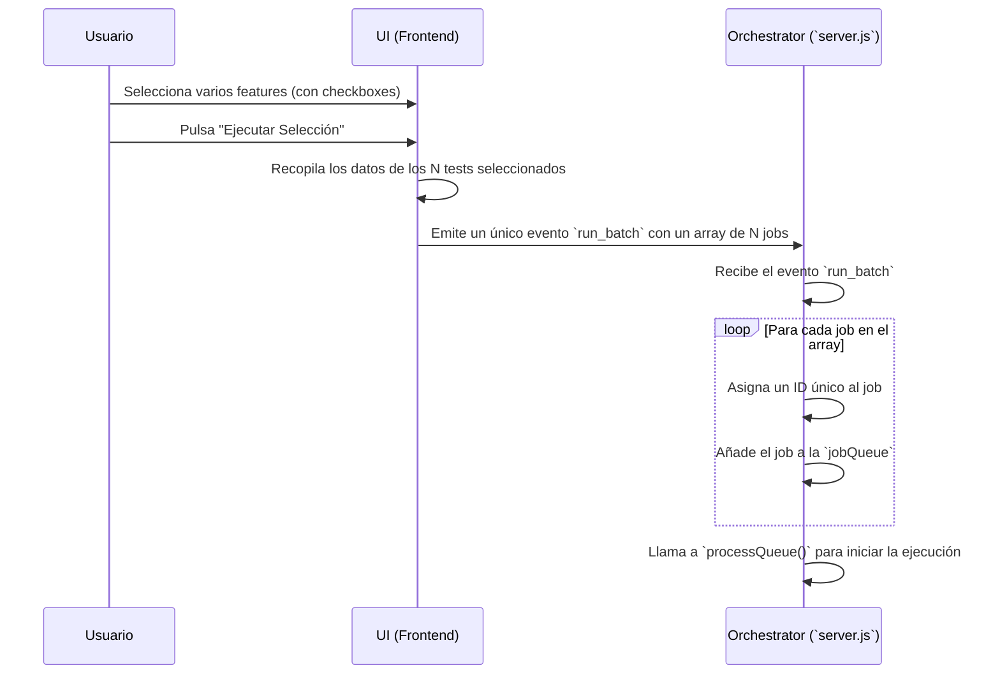

# Plan de Funcionalidad: Ejecución de Tests por Lotes (Batching)

## 1. Objetivo

Mejorar la experiencia de usuario permitiendo la selección y ejecución de múltiples tests (features) de forma simultánea. Esto agiliza el proceso de armado de una suite de regresión o de la ejecución de un conjunto de tests relacionados, en lugar de tener que iniciarlos uno por uno.

---

## 2. Arquitectura y Flujo de Trabajo

La implementación se centrará principalmente en la interfaz de usuario (frontend) y en el punto de entrada de jobs del orquestador (backend), sin requerir cambios significativos en la lógica de los workers o en el procesamiento de la cola.

### Flujo de Ejecución por Lote

---

## 3. Plan de Acción Detallado

### a. Modificaciones en la Interfaz (UI) - `public/index.html`

1.  **Añadir Checkboxes a la Lista de Features:**
    *   Al renderizar la lista de features, cada item (`<li>`) deberá incluir un `<input type="checkbox">` al principio.
    *   El `value` del checkbox puede contener el nombre del feature para una fácil identificación.

2.  **Añadir Controles de Selección:**
    *   **Botón "Ejecutar Selección":** Añadir un nuevo botón principal (ej. "Run Selected Features"). Este botón estará deshabilitado por defecto y se activará solo cuando al menos un checkbox esté seleccionado.
    *   **(Opcional, UX) Checkbox "Seleccionar Todo":** Añadir un checkbox en la cabecera de la lista de features que permita seleccionar o deseleccionar todos los features de la lista de una sola vez.

3.  **Actualizar Lógica de JavaScript:**
    *   Añadir un event listener al nuevo botón "Ejecutar Selección".
    *   Al hacer clic, el script deberá:
        1.  Iterar sobre todos los checkboxes de la lista de features.
        2.  Crear un array de objetos `job`, donde cada objeto contiene los datos de un feature seleccionado (`branch`, `client`, `feature`).
        3.  Emitir un nuevo evento de socket, por ejemplo `run_batch`, enviando el array de jobs como payload: `socket.emit('run_batch', { jobs: [...] });`.

### b. Modificaciones en el Orquestador (Backend) - `server.js`

1.  **Añadir Nuevo Manejador de Evento Socket:**
    *   Crear un nuevo listener para el evento `run_batch`: `socket.on('run_batch', (data) => { ... });`.

2.  **Implementar Lógica de Encolado Múltiple:**
    *   Dentro del nuevo listener, el servidor recibirá el objeto `data` que contiene el array `jobs`.
    *   Deberá iterar sobre `data.jobs`.
    *   Por cada `job` en el array, realizará la misma lógica que el actual listener `run_test`:
        1.  Incrementar y asignar un `jobIdCounter` único.
        2.  Añadir el job (con su nuevo ID) a la `jobQueue`.
        3.  Emitir un log a la UI informando que el test ha sido encolado.
    *   Después de que el bucle haya terminado de añadir todos los jobs a la cola, llamar a `processQueue()` **una sola vez** para que el orquestador comience a despachar los nuevos trabajos.

---

## 4. Impacto en el Sistema

- **Bajo Impacto en el Backend Profundo:** Esta funcionalidad no afecta la lógica de los workers, la asignación de slots, ni el procesamiento de la cola. Simplemente cambia la forma en que los trabajos se añaden a la cola (de uno en uno a muchos a la vez).
- **Mejora de Usabilidad:** El impacto principal es una mejora significativa en la experiencia del usuario, haciendo la herramienta más eficiente para casos de uso de regresión.
