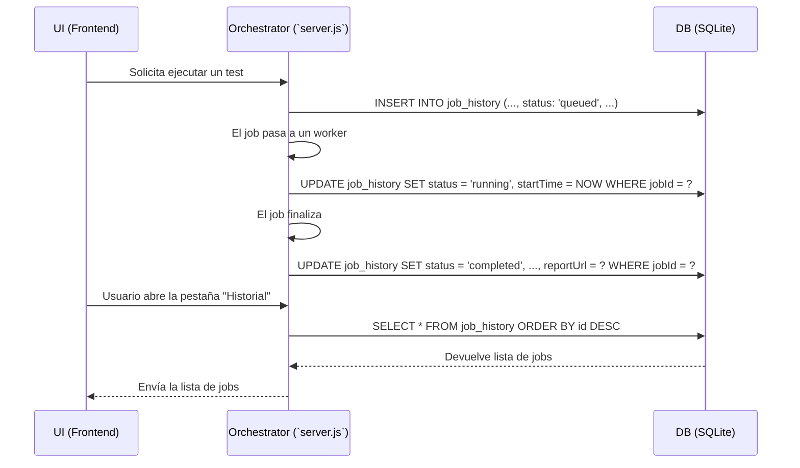

# Plan de Funcionalidad: Historial de Ejecuciones Persistente

## 1. Objetivo

Crear un registro histórico y persistente de todas las ejecuciones de tests que pasan por el orquestador. Esto transforma la herramienta de un simple ejecutor a un sistema de registro que permite análisis de tendencias, depuración de fallos pasados y una visión general de la actividad de testing.

---

## 2. Arquitectura y Componentes Clave

La implementación de esta funcionalidad requiere un componente clave nuevo: una base de datos ligera para almacenar los registros de forma persistente.

### a. Base de Datos (Almacenamiento)

- **Tecnología Propuesta:** **SQLite**. Es una base de datos basada en un único archivo, no requiere un servidor separado y está excelentemente soportada en Node.js (ej. con la librería `better-sqlite3`). Es la opción ideal, ya que encapsula todo el historial en un solo archivo (ej. `db.sqlite`) dentro del proyecto, siendo robusta y fácil de gestionar.
- **Alternativa (No recomendada):** Un archivo JSON. Aunque más simple de iniciar, es propenso a corrupción, no es eficiente para búsquedas o actualizaciones y no escala bien.

### b. Modelo de Datos

Se creará una tabla en la base de datos (ej. `job_history`) con la siguiente estructura:

- `id`: INTEGER, PRIMARY KEY (autoincremental)
- `jobId`: INTEGER (el ID que ya usamos en la cola)
- `branch`: TEXT
- `feature`: TEXT
- `client`: TEXT
- `status`: TEXT (`queued`, `running`, `completed`, `failed`, `cancelled`)
- `submitTime`: DATETIME (cuando se añadió a la cola)
- `startTime`: DATETIME (cuando el worker empezó a ejecutarlo)
- `endTime`: DATETIME (cuando el worker finalizó)
- `duration`: INTEGER (en segundos)
- `reportUrl`: TEXT (enlace al reporte de Allure, si existe)
- `finalLog`: TEXT (opcional, para guardar las últimas líneas del log o un resumen del error)

### c. Flujo de Datos

---

## 3. Plan de Acción Detallado

### a. Modificaciones en el Backend (`server.js`)

1.  **Integrar SQLite:**
    *   Añadir `better-sqlite3` como dependencia del proyecto (`npm install better-sqlite3`).
    *   Crear un módulo de inicialización de la base de datos que cree la tabla `job_history` si no existe.

2.  **Modificar el Ciclo de Vida del Job:**
    *   **Al encolar:** Justo después de asignar un `jobId`, hacer un `INSERT` en la base de datos con el estado `queued`.
    *   **Al iniciar:** Cuando un worker toma un job (`runJobOnWorker`), hacer un `UPDATE` para cambiar el `status` a `running` y registrar el `startTime`.
    *   **Al finalizar:** Cuando se recibe el mensaje `DONE` o `READY_FOR_NEXT_JOB` del worker, hacer un `UPDATE` final con el estado (`completed`/`failed`), `endTime`, `duration` y la `reportUrl`.

3.  **Crear API de Historial:**
    *   Crear un nuevo endpoint de API, ej. `GET /api/history`.
    *   Este endpoint consultará la base de datos y devolverá una lista de los registros históricos (ej. los últimos 100, con paginación).
    *   La API debería soportar filtros básicos como query params (ej. `GET /api/history?status=failed`).

### b. Modificaciones en la Interfaz (UI) - `public/index.html`

1.  **Nueva Pestaña "Historial":**
    *   Añadir una nueva pestaña a la navegación principal.

2.  **Vista de Tabla de Historial:**
    *   Al hacer clic en la pestaña, la UI hará una petición a `GET /api/history`.
    *   Los datos recibidos se renderizarán en una tabla.
    *   La tabla mostrará columnas relevantes: `ID`, `Branch`, `Feature`, `Estado`, `Duración`, `Fecha`, y un botón/enlace a `Reporte`.

3.  **Controles de Filtro y Paginación:**
    *   Añadir controles básicos en la parte superior de la tabla para filtrar por estado (ej. un dropdown con "Todos", "Completados", "Fallidos").
    *   Añadir botones de "Siguiente" y "Anterior" para la paginación si se implementa en la API.

