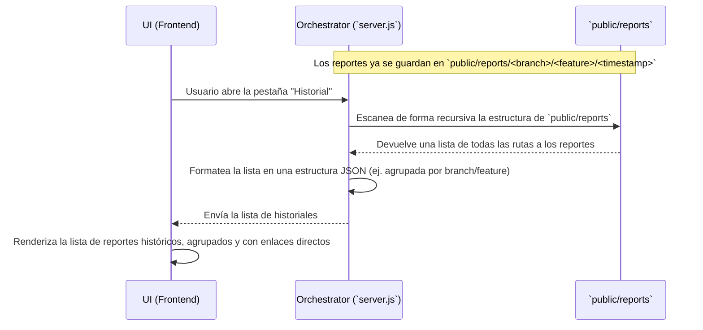

# Plan de Funcionalidad: Historial de Ejecuciones Basado en Reportes

## 1. Objetivo

Crear un registro histórico de las ejecuciones de tests utilizando los propios reportes de Allure generados como fuente de verdad. Esto evita la necesidad de una base de datos y aprovecha la estructura de directorios existente para proporcionar un historial navegable.

---

## 2. Arquitectura y Componentes Clave

El historial será una representación directa de la estructura de carpetas dentro de `public/reports`. La lógica principal residirá en un nuevo endpoint de API que escaneará este directorio y lo expondrá a la interfaz de usuario.

### Flujo de Datos



---

## 3. Plan de Acción Detallado

### a. Modificaciones en el Backend (`server.js`)

1.  **Crear API de Historial (`GET /api/history`):**
    *   Crear un nuevo endpoint de API.
    *   Este endpoint utilizará el módulo `fs` de Node.js para leer la estructura del directorio `public/reports`.
    *   De forma recursiva, listará todas las branches, features y timestamps.
    *   Construirá un objeto JSON que represente esta jerarquía. El resultado podría ser un array de objetos, donde cada objeto contiene `branch`, `feature`, `timestamp` y la `reportUrl` (que se puede construir a partir de las partes).
    *   Ejemplo de respuesta de la API:
        ```json
        [
          {
            "branch": "develop",
            "feature": "login",
            "timestamp": "2025-08-26T18-30-00",
            "reportUrl": "/reports/develop/login/2025-08-26T18-30-00/"
          },
          {
            "branch": "develop",
            "feature": "login",
            "timestamp": "2025-08-26T18-35-10",
            "reportUrl": "/reports/develop/login/2025-08-26T18-35-10/"
          }
        ]
        ```
    *   La API devolverá este JSON.

### b. Modificaciones en la Interfaz (UI) - `public/index.html`

1.  **Renombrar Pestaña "Resultados" a "Historial":**
    *   La pestaña que creamos anteriormente para "Resultados Recientes" ahora servirá como el historial persistente. Se renombrará el botón y el ID del panel.

2.  **Implementar Carga de Historial:**
    *   Cuando el usuario haga clic en la pestaña "Historial" por primera vez, se hará una llamada a la nueva API `GET /api/history`.
    *   La lista de "Resultados Recientes" (`recent-results-list`) ya no se poblará con el evento `job_finished`. En su lugar, se llenará con los datos recibidos de la API.
    *   El script de la UI iterará sobre el array de historiales y creará un elemento de lista (`<li>`) para cada uno, mostrando el nombre del feature, la branch, el timestamp y un botón "Ver Reporte" que apunte a la `reportUrl`.

3.  **(Opcional) Mantener "Resultados Recientes":**
    *   La lista de resultados de la sesión actual sigue siendo útil. Podemos mantenerla en la pestaña "Setup" o moverla también a la pestaña "Historial", encima de la lista del historial completo cargado desde la API. Por simplicidad, el plan inicial es reemplazarla.

---

Este nuevo plan es mucho más ligero y se integra perfectamente con la funcionalidad de reportes que ya hemos construido.