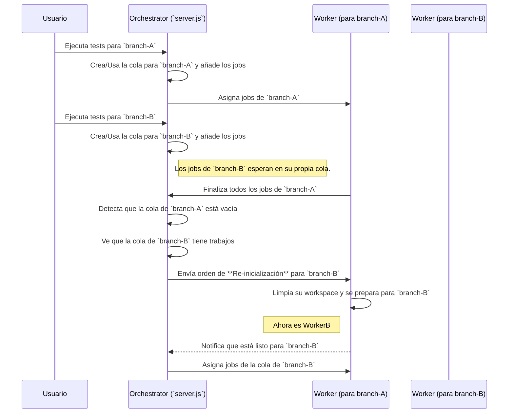

# Plan de Funcionalidad: Colas de Ejecución por Branch

## 1. Objetivo

Evolucionar la arquitectura del orquestador para que soporte múltiples colas de ejecución, donde cada cola está asociada a una `branch` específica. Esto permitirá encolar tests para diferentes branches de forma independiente y que los workers, una vez que finalicen todos los trabajos de su branch actual, puedan ser reasignados a otra branch que tenga trabajos en espera.

---

## 2. Concepto y Arquitectura

El cambio principal es reemplazar la cola global (`jobQueue`) por una estructura de datos que pueda gestionar múltiples colas. Un `Map` de JavaScript es ideal para esto, donde la clave es el nombre de la branch y el valor es el array de jobs para esa branch.

### Flujo de Trabajo Propuesto

---

## 3. Plan de Acción Detallado

### a. Modificaciones en el Backend (`server.js`)

1.  **Reemplazar la Estructura de Cola:**
    *   Cambiar `const jobQueue = [];` por `const branchQueues = new Map();`.

2.  **Actualizar la Lógica de Encolado:**
    *   Los manejadores `run_test` y `run_batch` ya no añadirán a una cola global.
    *   En su lugar, obtendrán la `branch` del job, buscarán la cola correspondiente en `branchQueues` (creándola si no existe) y añadirán el job a ese array específico.

3.  **Rediseñar el "Scheduler" (`processQueue` -> `scheduleJobs`):**
    *   La función `processQueue` debe ser más inteligente. Su nueva lógica será:
        1.  **Prioridad 1 (Jobs existentes):** Buscar si hay jobs en una cola de branch que ya tenga un worker `listo` asignado.
        2.  **Prioridad 2 (Reasignación):** Buscar si hay algún worker cuyo trabajo haya terminado y su cola de branch esté vacía. Si existe, y hay otra cola de branch con trabajos esperando, se le asigna esa nueva branch al worker.
        3.  **Prioridad 3 (Nuevo Worker):** Si aún hay capacidad en el pool (`workerPool.length < maxWorkers`), tomar un job de la cola más antigua y crear un nuevo worker para ella.

4.  **Implementar la Re-inicialización del Worker:**
    *   Cuando se decida reasignar un worker (Punto 2 del scheduler), el orquestador le enviará un nuevo mensaje, por ejemplo: `{ type: 'REINIT', newBranch: '...' }`.

### b. Modificaciones en el Worker (`worker.js`)

1.  **Manejar el Mensaje `REINIT`:**
    *   Añadir un `case 'REINIT':` al manejador de mensajes del worker.
    *   Este caso llamará a una función que:
        1.  Elimine el directorio de trabajo (`workspaceDir`) actual.
        2.  Vuelva a ejecutar la función `setupWorkspace()` con la `newBranch` recibida.

### c. Modificaciones en la Interfaz (UI)

1.  **Visualización de Múltiples Colas:**
    *   El indicador de "Estado de la Cola" en la UI debería ser capaz de mostrar un resumen de todas las colas activas. Por ejemplo:
        *   `Branch 'develop': 5 en cola`
        *   `Branch 'feature/login': 2 en cola`

---

**Mi Opinión:**

Este es un cambio arquitectónico significativo y muy positivo. Hace que el orquestador sea mucho más potente y se alinea mejor con los flujos de trabajo de un equipo de desarrollo que trabaja en múltiples features a la vez. El plan es complejo, pero se puede implementar por fases de manera segura.
