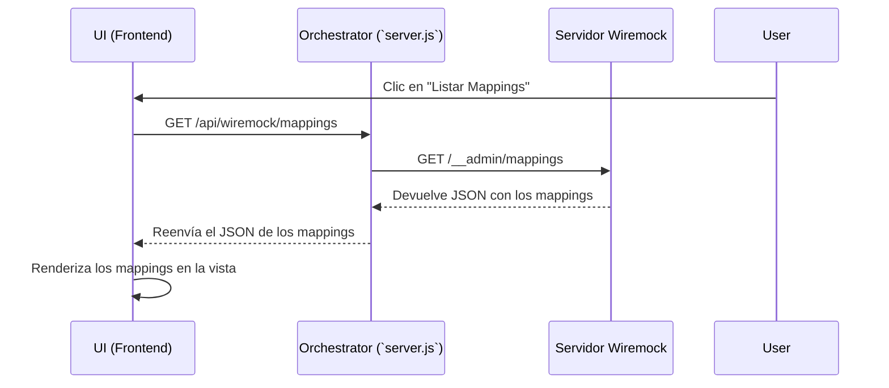

# Plan de Funcionalidad: Interfaz de Gestión de Wiremock

## 1. Objetivo

Crear una nueva pestaña en la interfaz del orquestador llamada "Wiremock" que permita a los usuarios interactuar con la API de administración de un servidor Wiremock. Esto centralizará el control sobre los mocks, permitiendo ver mappings, requests, resetear el estado y gestionar grabaciones sin salir de la aplicación.

---

## 2. Arquitectura y Componentes Clave

La implementación se basará en un modelo de **proxy en el backend**. El frontend no llamará directamente a Wiremock, sino a una serie de nuevos endpoints en nuestro `server.js`, que a su vez reenviarán la petición al servidor de Wiremock. Esto evita problemas de CORS y mantiene la URL de Wiremock centralizada en la configuración del servidor.

### Flujo de Trabajo



### Endpoints de Wiremock a Exponer

Basado en la colección de Postman, los endpoints clave a gestionar son:

*   **Mappings:** `GET`, `DELETE`, `POST /reset`, `POST /import`
*   **Requests:** `GET`, `DELETE`
*   **Scenarios:** `GET`
*   **Recordings:** `GET /status`, `POST /start`, `POST /stop`
*   **Files:** `GET /files`

---

## 3. Plan de Acción Detallado

### a. Modificaciones en el Backend (`server.js`)

1.  **Añadir Configuración en `.env`:**
    *   Añadir una nueva variable para la URL base del admin de Wiremock: `WIREMOCK_ADMIN_URL=https://doit-nbch-automation.pcnt.io:8443`.

2.  **Crear Endpoints Proxy (`/api/wiremock/*`):**
    *   Crear un nuevo conjunto de rutas que empiecen con `/api/wiremock`.
    *   Cada ruta en el backend corresponderá a una acción en la API de Wiremock. Utilizará `node-fetch` o `axios` para hacer la llamada real al servidor Wiremock y devolverá la respuesta al cliente.
    *   **Ejemplo (Listar Mappings):**
        ```javascript
        app.get('/api/wiremock/mappings', async (req, res) => {
            try {
                const response = await fetch(`${process.env.WIREMOCK_ADMIN_URL}/__admin/mappings`);
                const data = await response.json();
                res.json(data);
            } catch (error) {
                res.status(500).json({ error: 'Error al contactar con Wiremock' });
            }
        });
        ```
    *   Se implementarán endpoints similares para las demás acciones (DELETE, POST, etc.), asegurándose de que el método y el cuerpo de la petición se reenvíen correctamente.

### b. Modificaciones en la Interfaz (UI)

1.  **Añadir Pestaña "Wiremock" en `index.html`:**
    *   Añadir un nuevo botón al contenedor de pestañas.
    *   Crear un nuevo `div` con `id="wiremock-view"` que contendrá la interfaz de esta nueva sección.

2.  **Diseñar la Interfaz de la Pestaña Wiremock:**
    *   La pestaña podría tener sub-secciones para una mejor organización (ej. Mappings, Requests, Grabaciones).
    *   **Sección de Mappings:**
        *   Botones: "Listar", "Eliminar Todos", "Resetear".
        *   Un área de texto (`<textarea>`) para pegar un JSON de mappings y un botón "Importar".
        *   Un visor de JSON (`<pre>`) para mostrar los resultados.
    *   **Sección de Requests:**
        *   Botones: "Listar", "Eliminar Todos".
        *   Un visor de JSON para los requests recibidos.
    *   **Sección de Grabaciones:**
        *   Un campo de texto para la `targetBaseUrl`.
        *   Botones: "Iniciar Grabación", "Detener Grabación", "Ver Estado".
        *   Un visor para mostrar los mappings generados al detener la grabación.

3.  **Crear Lógica en el Frontend (`wiremock.js`):**
    *   Crear un nuevo archivo `public/js/wiremock.js`.
    *   Este archivo contendrá las funciones para:
        *   Llamar a los nuevos endpoints del backend (`/api/wiremock/*`).
        *   Renderizar las respuestas JSON en los visores correspondientes.
        *   Manejar los eventos de los botones y formularios.
    *   Añadir la referencia a este nuevo script en `index.html`.

--- 

Este plan nos proporciona una hoja de ruta clara para integrar la gestión de Wiremock de forma segura y usable dentro de nuestra aplicación.

---

## 4. Flujos de Trabajo Detallados con Wiremock

Existen dos enfoques principales para utilizar Wiremock, ambos soportados por su API. La interfaz debe facilitar ambos.

### Flujo 1: Grabación y Reproducción (Record & Playback)

Este método es ideal para crear una base de mocks rápidamente a partir de un servicio existente.

*   **Concepto:** Se pone a Wiremock en modo "grabadora". Todas las peticiones que recibe (y que no corresponden a un mock existente) son reenviadas a un servicio real (`targetBaseUrl`). Wiremock graba tanto la petición como la respuesta y, al detener la grabación, genera los mappings correspondientes.
*   **Limitación Clave:** Este modo solo soporta **una única `targetBaseUrl`** por sesión de grabación. No es adecuado para escenarios donde la aplicación cliente consume múltiples APIs de diferentes dominios.
*   **Pasos en la UI:**
    1.  **Iniciar:** El usuario introduce la URL del servicio a grabar (ej. `http://api-real.com`) y pulsa "Iniciar Grabación".
    2.  **Ejecutar:** Se utiliza la aplicación cliente para generar tráfico hacia el servicio real a través de Wiremock.
    3.  **Detener:** El usuario pulsa "Detener Grabación". La UI muestra el JSON de los mappings que Wiremock ha capturado.

### Flujo 2: Proxy Selectivo y Mocking Manual

Este es el enfoque más potente y flexible, ideal para entornos complejos con múltiples servicios o para crear escenarios de prueba muy específicos.

*   **Concepto:** En lugar de una grabación global, se definen "mappings" (reglas) individuales. Algunas de estas reglas pueden ser mocks tradicionales (devolver una respuesta fija), mientras que otras pueden actuar como un proxy a un servicio real.
*   **Solución para Múltiples `baseUrl`:** Este es el método para manejar una aplicación que habla con varios servicios. Se crea un mapping de proxy para cada servicio real.
*   **Ejemplo de Mappings Híbridos (Proxy + Mock):**
    ```json
    {
      "mappings": [
        // Regla de Proxy: Reenvía todo lo de /auth a su servicio real.
        {
          "priority": 10,
          "request": { "urlPattern": "/auth/.*" },
          "response": { "proxyBaseUrl": "http://servicio-auth-real.com" }
        },
        // Regla de Proxy: Reenvía todo lo de /pagos a su servicio real.
        {
          "priority": 10,
          "request": { "urlPattern": "/pagos/.*" },
          "response": { "proxyBaseUrl": "http://servicio-pagos-real.com" }
        },
        // Regla de Mock: Para un caso específico, sobreescribe el proxy y devuelve un error 404.
        {
          "priority": 1, // Prioridad más alta para tener precedencia
          "request": { "method": "GET", "url": "/pagos/factura/123" },
          "response": { "status": 404 }
        }
      ]
    }
    ```
*   **Pasos en la UI:**
    1.  **Importar:** El usuario pega el JSON de mappings en el área de texto correspondiente y pulsa "Importar".
    2.  **Verificar:** El usuario puede usar "Listar Mappings" para ver las reglas que se cargaron.
    3.  **Depurar:** Con "Listar Requests", el usuario puede ver qué peticiones está recibiendo Wiremock y si están haciendo match con los mocks o los proxies.
    4.  **Limpiar:** "Resetear" o "Eliminar Mappings" permite limpiar el estado para la siguiente prueba.