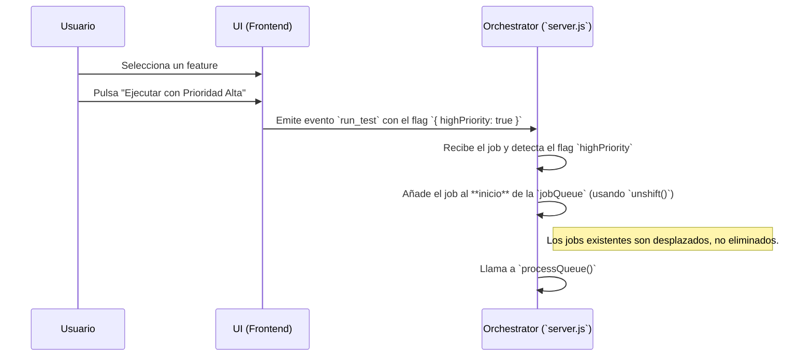

# Plan de Funcionalidad: Prioridad de Jobs

## 1. Objetivo

Introducir un sistema de prioridades en la cola de ejecución para permitir que los tests urgentes o críticos se ejecuten antes que los trabajos de baja prioridad, sin tener que esperar a que la cola se vacíe.

---

## 2. Concepto General

La funcionalidad se implementará añadiendo una opción en la UI para marcar un test o un lote de tests como "de alta prioridad". El backend utilizará esta información para añadir el trabajo al principio de la cola (`head`) en lugar del final (`tail`).

### Flujo de Trabajo de Alta Prioridad



---

## 3. Plan de Acción Detallado

### a. Modificaciones en la Interfaz (UI) - `public/index.html`

1.  **Nuevo Botón "Prioridad Alta":**
    *   Junto a cada botón individual de "Run", añadir un segundo botón, quizás con un icono (⚡) o texto, como "Run Priority".
    *   Este botón activará la misma lógica que el de "Run", pero añadiendo un flag de prioridad.

2.  **Integración con el Batching:**
    *   Cerca del botón "Ejecutar Selección" (del plan de batching), añadir un checkbox con el texto "Ejecutar lote con alta prioridad".
    *   Si este checkbox está marcado, el evento `run_batch` también enviará el flag de prioridad.

3.  **Lógica de JavaScript:**
    *   Modificar los manejadores de eventos de los nuevos botones para que, al emitir el evento `run_test` o `run_batch`, el payload incluya el flag: `socket.emit('run_test', { ..., highPriority: true });`

### b. Modificaciones en el Orquestador (Backend) - `server.js`

1.  **Actualizar Manejadores de Eventos Socket:**
    *   Tanto en `socket.on('run_test', ...)` como en `socket.on('run_batch', ...)` se debe inspeccionar el objeto `data` recibido para ver si existe la propiedad `highPriority`.

2.  **Implementar Encolado Prioritario:**
    *   Dentro de la lógica de encolado, añadir una simple condición:

    ```javascript
    // Ejemplo para un solo job
    const job = { ...data, id: jobIdCounter };

    if (job.highPriority) {
        jobQueue.unshift(job); // Añadir al principio
        io.emit('log_update', { logLine: `--- ⚡️ Test '${job.feature}' añadido a la cola con prioridad alta. ---\n` });
    } else {
        jobQueue.push(job); // Comportamiento normal: añadir al final
        io.emit('log_update', { logLine: `--- ⏳ Test '${job.feature}' encolado. ---\n` });
    }
    ```

---

## 4. Impacto en el Sistema

- **Mínimo:** Es una de las mejoras con mejor ratio de valor/esfuerzo.
- **No destructivo:** No requiere cambios en la arquitectura de workers, solo en la forma de organizar la cola de espera.
- **Transparente:** Para los usuarios que no usen la función, el comportamiento del sistema es exactamente el mismo.

```