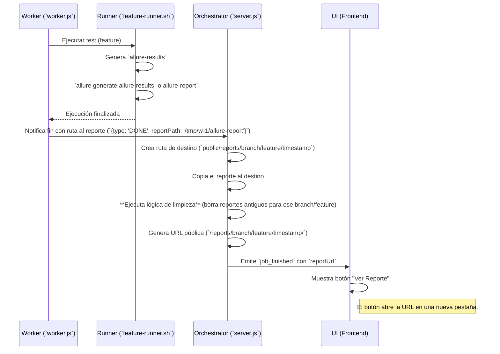

# Plan de Integración de Reportes Allure

## 1. Objetivo

Integrar los reportes HTML de Allure en la interfaz del orquestador. Después de que un `feature` se ejecute, el usuario debe tener un botón para visualizar el reporte de test detallado generado para esa ejecución específica.

---

## 2. Arquitectura Propuesta

Se seguirá un flujo de trabajo que distribuye las responsabilidades entre el Worker y el Orquestador para garantizar la seguridad y la cohesión del sistema.

### Flujo de Datos del Reporte



---

## 3. Plan de Acción Detallado

### a. Modificaciones en el Worker

1.  **`appium-orchestrator-web/scripts/feature-runner.sh`:**
    *   Al final de la ejecución del test (después del comando `wdio`), añadir una nueva sección.
    *   Verificar si el directorio `allure-results` existe y tiene contenido.
    *   Si es así, ejecutar `allure generate ./allure-results -o ./allure-report --clean`.

2.  **`appium-orchestrator-web/worker.js`:**
    *   En la función `runTest`, dentro del callback `onDone` del script:
    *   Comprobar si el directorio `allure-report` existe en el workspace.
    *   Si existe, añadir la ruta absoluta a este directorio en el mensaje que se envía al orquestador.
    *   Modificar el mensaje `DONE` para que pueda incluir esta ruta: `sendToParent({ type: 'DONE', data: { exitCode: code, reportPath: 'path/to/report' } });`

### b. Modificaciones en el Orquestador

1.  **`appium-orchestrator-web/server.js`:**
    *   En el manejador de mensajes del worker, si el mensaje contiene `reportPath`:
        1.  Obtener `branch` y `feature` del job finalizado. Sanitizar los nombres para usarlos en rutas de directorio.
        2.  Definir el directorio de destino jerárquico: `public/reports/<branch>/<feature>`. Asegurarse de que exista.
        3.  Crear un subdirectorio único para el reporte actual usando un timestamp: `public/reports/<branch>/<feature>/<timestamp>`.
        4.  Copiar el contenido de `reportPath` a este nuevo directorio.
        5.  **Ejecutar la limpieza:** Llamar a una nueva función que liste los subdirectorios en `public/reports/<branch>/<feature>`, los ordene por fecha y elimine los más antiguos si se excede el límite `MAX_REPORTS_PER_FEATURE`.
        6.  Construir la URL pública relativa, ej: `/reports/<branch>/<feature>/<timestamp>/`.
        7.  Añadir esta `reportUrl` al objeto que se emite al frontend en el evento `job_finished`.

### c. Modificaciones en la Interfaz (UI)

1.  **`appium-orchestrator-web/public/index.html`:**
    *   En el listener del evento `socket.on('job_finished', ...)`:
    *   Comprobar si el objeto `data` contiene la propiedad `reportUrl`.
    *   Si es así, crear y mostrar un nuevo botón ("Ver Reporte") en el panel del job correspondiente.
    *   El botón debe ser un enlace (`<a>`) que apunte a la `reportUrl` y se abra en una nueva pestaña (`target="_blank"`).

---

## 4. Gestión y Limpieza de Reportes

Se implementará una estrategia de **Limpieza por Cantidad (N por Feature/Branch)** para mantener un historial relevante sin saturar el disco.

### a. Configuración

- Se añadirá una variable de entorno en el archivo `.env`: `MAX_REPORTS_PER_FEATURE`.
- Esta variable definirá cuántos reportes históricos se deben conservar por cada combinación única de branch y feature.
- Un valor razonable por defecto será `5`.

### b. Estructura de Directorios

Los reportes se almacenarán en una estructura jerárquica dentro de `public/reports` para facilitar la gestión:

```
public/reports/
└── <branch_sanitizada>/
    └── <feature_sanitizado>/
        ├── <timestamp_1>/  (Reporte más antiguo)
        ├── <timestamp_2>/
        └── <timestamp_3>/  (Reporte más reciente)
```

### c. Algoritmo de Limpieza

Este algoritmo se ejecutará en `server.js` cada vez que un nuevo reporte sea copiado exitosamente:

1.  **Leer Directorios:** Obtener la lista de todos los directorios de reportes (timestamps) dentro de la carpeta del feature específico (ej. `public/reports/develop/login`).
2.  **Ordenar:** Ordenar la lista de directorios numéricamente (ascendente), lo que corresponde a ordenarlos del más antiguo al más reciente.
3.  **Verificar Límite:** Si la cantidad de directorios es mayor que `MAX_REPORTS_PER_FEATURE`.
4.  **Eliminar Excedente:** Iterar sobre la lista ordenada y eliminar los directorios más antiguos (`fs.rm`) hasta que la cantidad sea igual al límite.

---

## 5. Consideraciones Adicionales

- **Instalación de Allure:** El plan asume que `allure` está disponible como comando en el entorno donde se ejecuta `feature-runner.sh`. Esto debe estar documentado como un prerrequisito. 
