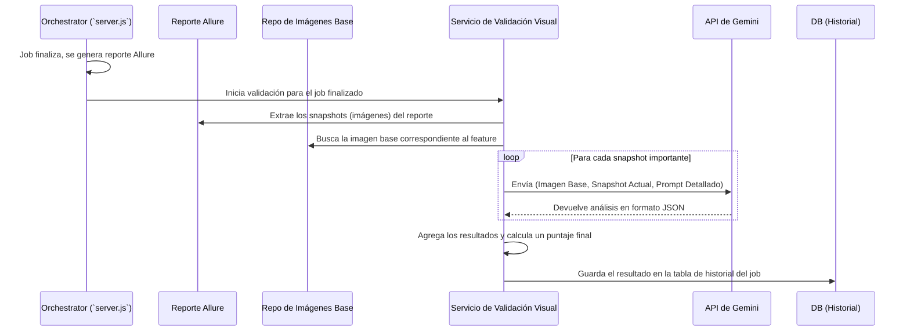

# Plan de Funcionalidad: Validación Visual Asistida por IA

## 1. Objetivo

Implementar un sistema que utilice un modelo de IA multimodal (Gemini) para comparar las capturas de pantalla (snapshots) generadas durante los tests de Appium con una imagen de "diseño base". El objetivo es obtener un análisis de confianza sobre la correcta composición visual de la UI, detectando elementos cortados, faltantes o mal posicionados, más allá de lo que una prueba funcional puede validar.

---

## 2. Viabilidad y Desafíos

*   **Viabilidad:** Alta. Los modelos multimodales modernos son capaces de comprender y comparar imágenes, identificando objetos, texto y su disposición espacial. Es un caso de uso ideal para esta tecnología.
*   **Desafíos:**
    1.  **Asociación de Imágenes:** Se necesita un método claro para que el sistema sepa qué "imagen base" corresponde a qué "feature" o pantalla del test.
    2.  **Ingeniería de Prompts:** El prompt que se envíe al modelo es crítico. Debe ser preciso para que la IA se enfoque en la composición y no en diferencias de píxeles exactos o cambios de posición menores debidos a distintas resoluciones de pantalla.
    3.  **Interpretación del Resultado:** La IA devolverá texto. Debemos estructurar el prompt para que la respuesta sea predecible (ej. un JSON con un puntaje y una lista de discrepancias) y así poder procesarla automáticamente.
    4.  **Integración y Rendimiento:** El proceso puede ser lento y tener costos asociados. Debe integrarse de forma que no bloquee el flujo principal y se ejecute de manera asíncrona.

---

## 3. Arquitectura y Flujo de Trabajo

El proceso se ejecutaría como un paso de post-procesamiento después de que un test finaliza y su reporte de Allure es generado.



---

## 4. Plan de Acción Detallado

### Fase 1: Prueba de Concepto y Diseño del Prompt

**Objetivo:** Validar el núcleo de la idea y perfeccionar la interacción con la IA.

1.  **Definir la Ubicación y Mapeo de Imágenes:**

    *   **a. Estructura de Imágenes Base:** Se creará una carpeta dedicada en el repositorio de Appium para almacenar las imágenes de referencia (`visual_baselines`). La estructura propuesta es:
        ```
        test/
        └── visual_baselines/
            ├── <client_name>/
            │   ├── <screen_or_feature_name>.png
            │   └── ...
        ```
        Al estar versionadas en Git, cualquier cambio en el diseño se refleja actualizando la imagen base correspondiente.

    *   **b. Estrategia de Mapeo entre Snapshot y Base:** Para asociar de forma inequívoca la captura de un test con su imagen de referencia, se seguirá una estrategia de **nomenclatura explícita**. El test de Appium será modificado para tomar capturas de pantalla en puntos de validación concretos y guardarlas con un nombre específico que actúe como **identificador único**.

        > **Ejemplo:** Un test que valida la pantalla de login, en el `step` de validación visual, tomará una captura y la guardará con el nombre `login_screen.png`. El servicio de validación buscará entonces una imagen base con exactamente el mismo nombre en el directorio correspondiente (`visual_baselines/<client>/login_screen.png`) para realizar la comparación.

    *   **c. Abordaje Intencional:** Este enfoque es deliberado. Se descarta la idea de tomar capturas en cada paso o de enviar todas las imágenes a la IA para que ella infiera las relaciones. El método de nombrado explícito es más eficiente, predecible y nos da control total sobre qué se valida visualmente y contra qué.

2.  **Diseñar el Prompt para Gemini:**
    *   Este es el paso más importante. El prompt debe ser claro y pedir una respuesta estructurada.

    > **Ejemplo de Prompt:**
    >
    > "Eres un experto en QA de UI. Te proporciono dos imágenes: la '''Imagen Base''' es el diseño de referencia y el '''Snapshot Actual''' es una captura de un test. Ignora las diferencias de resolución y las variaciones de datos (como nombres de usuario o fechas). Tu tarea es analizar si los elementos de la '''Imagen Base''' están presentes, completos y en una posición relativa similar en el '''Snapshot Actual'''.
    >
    > Responde únicamente con un objeto JSON con la siguiente estructura:
    > {
    >   "match_score": <un número de 0 a 100 que represente tu confianza en que el diseño se respeta>,
    >   "missing_elements": ["<lista de elementos del diseño que no encuentras en el snapshot>"],
    >   "misaligned_elements": ["<lista de elementos que están en una posición extraña o muy diferente>"],
    >   "truncated_elements": ["<lista de elementos que parecen cortados o no se ven completos>"],
    >   "summary": "<un resumen en una frase de tu análisis>"
    > }"

3.  **Ejecución Manual:**
    *   Realizar una llamada manual a la API de Gemini con un par de imágenes (una base y un snapshot de un reporte) para validar y refinar el prompt hasta que la respuesta sea consistente y útil.

### Fase 2: Integración en el Orquestador

**Objetivo:** Automatizar el proceso de validación.

1.  **Crear el `VisualValidatorService` en `server.js`:**
    *   Este nuevo módulo se activará después de que un job termine y su reporte se haya copiado.
    *   Será responsable de orquestar todo el flujo descrito en el diagrama.

2.  **Extracción de Snapshots del Reporte:**
    *   El servicio necesitará una función para parsear el reporte de Allure generado y extraer las rutas a las imágenes de los steps.

3.  **Modificar la Base de Datos:**
    *   Añadir nuevas columnas a la tabla `job_history` (o una tabla nueva) para almacenar el resultado: `visual_score` (numérico), `visual_issues` (JSON/TEXT).

4.  **Integración con la UI:**
    *   En la vista de historial, mostrar el `visual_score` junto a cada ejecución.
    *   Al hacer clic, mostrar un modal o una sección con el detalle de los problemas (`visual_issues`) reportados por la IA.
